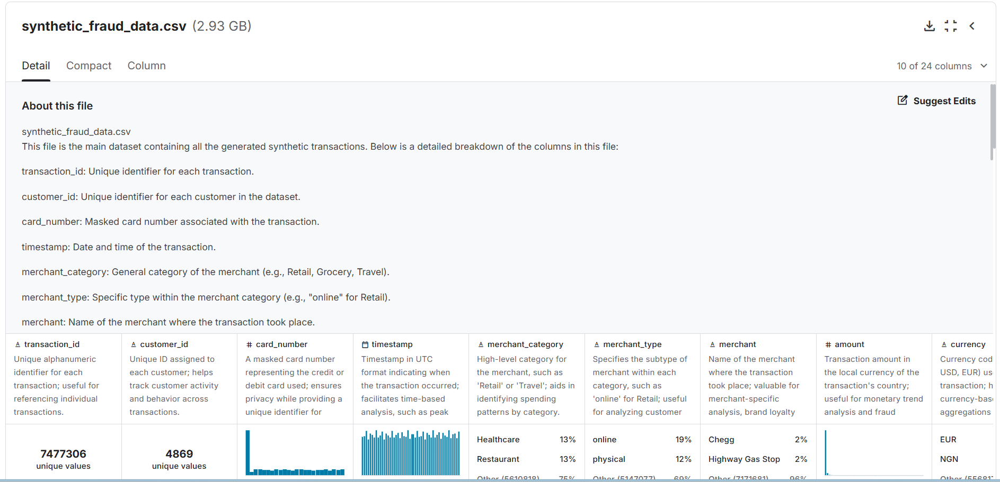
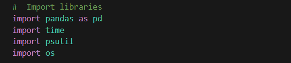
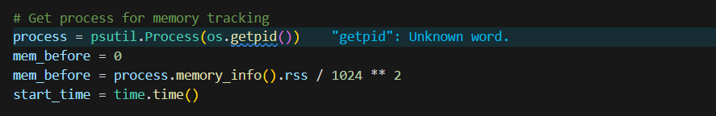
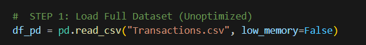
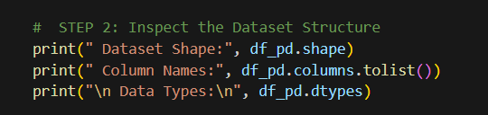
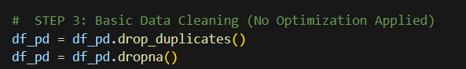
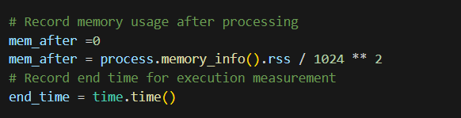
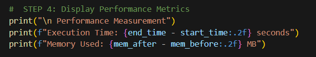
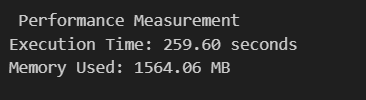

# 📊 SECP3133 – High Performance Data Processing (Section 02)

## 🧠 Assignment 2: Mastering Big Data Handling

 **Group AK47**  
| Name          | Matric No  |
|---------------|------------|
| Goh Jing Yang | A22EC0052  |
| Loo Jia Chang | A22EC0074  |

---

## Project Overview
For this assignment, the chosen dataset is Transactions.csv, a synthetic financial transactions dataset created using Python. The file size is approximately 2.93 GB, containing over 900,000 transaction records with 24 columns covering various data types including string, boolean, and integer fields.

This dataset is designed for developing and testing fraud detection models by simulating realistic financial transaction patterns. It spans multiple merchant categories such as retail (both online and in-store), groceries, dining, travel, entertainment, healthcare, education, and gas. The diversity in transaction types and customer profiles makes it well-suited for exploratory analysis and performance comparison of big data processing techniques.

## Intoduction
In today’s data-driven landscape, organizations must process and analyze ever-growing datasets that surpass the capabilities of traditional data handling tools. This project tackles these challenges by working with a large-scale financial transactions dataset—ideal for exploring big data processing in fraud detection. Using Python and scalable data libraries, we demonstrate real-world strategies to efficiently manage, analyze, and extract insights from massive transaction records, preparing for practical scenarios in financial analytics and security.

## Objective
The objective of this project is to master efficient big data processing on a large-scale financial transactions dataset by utilizing advanced Python libraries such as Pandas, Dask, and Polars. We focus on applying and comparing high-performance strategies—including chunking, sampling, type optimization, and parallel processing—to optimize memory usage, execution time, and analytical capability. This project aims to demonstrate the effectiveness of modern data processing frameworks for extracting insights and supporting fraud detection in the financial sector.

## Task 1: Dataset Selection
### Dataset Description
This synthetic dataset simulates realistic financial transactions for developing and testing fraud detection models. It covers a variety of categories—such as retail, grocery, dining, and travel—and includes key features like transaction amounts, device types, geographic locations, and a fraud label. Inspired by real-world data but generated to ensure privacy, the dataset is ideal for exploring patterns that distinguish legitimate from fraudulent transactions.

- **Name:** Transactions.csv  
- **Size:** Approximately 2.93 GB  
- **Rows:** 7483766  
- **Columns:** 24

The dataset falls within the Financial Fraud Detection domain. It integrates data science with cybersecurity and financial analytics by offering insights into:

  <ul>
    <li>Transaction metadata including amounts, timestamps, and geographic details.</li>
    <li>Customer and device characteristics such as card types, device fingerprints, and transaction channels.</li>
    <li>Fraud indicators and behavioral metrics like transaction velocity, merchant risk scores, and binary fraud labels.</li>
  </ul>

  

    
    
<strong>Figure 1.1:</strong> Overview of Transactions.csv

  

## Task 2: Load and Inspect Data
To work with our large Transactions dataset in Python, we used Pandas and several memory management techniques to handle the file efficiently and to inspect its structure. Below are the key steps and their purposes:

### 1. Import Required Libraries
We import essential libraries:

- pandas for data handling,
- time for tracking execution time,
- psutil and os for monitoring memory usage.

This allows us to measure performance and handle the dataset programmatically.
 

    
  

### 2. Set Up Memory and Time Tracking
Before loading the data, we initialize memory and time tracking to measure how resource-intensive the loading process is. This is especially useful for large datasets, as it helps us understand and compare the efficiency of different data-handling approaches.

 

    
  

### 3. Load the Full Dataset (Unoptimized)
We use Pandas’ read_csv function to load the entire CSV file into memory. The low_memory=False parameter helps Pandas to infer data types more accurately but may use more memory.

 

    
  

  ### 4. Inspect the Dataset Structure
After loading the data, we inspect its structure:

- Shape: Total rows and columns,
- Column Names: To understand what information is available,
- Data Types: To check if the types are as expected.
  
 

    
  

  ### 5. Basic Data Cleaning
To prepare for analysis, we remove duplicate records and any rows with missing values. This ensures the data is clean and consistent for further processing.

 

    
  

  ### 6. Display Performance Metrics
Finally, we record memory usage after loading and cleaning, and calculate the time taken. This provides insight into the cost of handling large files with Pandas and serves as a baseline for comparison with other libraries.

    
  

    
  

    
    
<strong>Output</strong>

  </div

## Task 3: Apply Big Data Handling Strategies

## Task 4: Comparative Analysis

## Task 5: Conclusion & Reflection

