# 📊 SECP3133 – High Performance Data Processing (Section 02)

## 🧠 Assignment 2: Mastering Big Data Handling

 **Group AK47**  
| Name          | Matric No  |
|---------------|------------|
| Goh Jing Yang | A22EC0052  |
| Loo Jia Chang | A22EC0074  |

---

## Project Overview
For this assignment, the chosen dataset is Transactions.csv, a synthetic financial transactions dataset created using Python. The file size is approximately 2.93 GB, containing over 900,000 transaction records with 24 columns covering various data types including string, boolean, and integer fields.

This dataset is designed for developing and testing fraud detection models by simulating realistic financial transaction patterns. It spans multiple merchant categories such as retail (both online and in-store), groceries, dining, travel, entertainment, healthcare, education, and gas. The diversity in transaction types and customer profiles makes it well-suited for exploratory analysis and performance comparison of big data processing techniques.

## Intoduction
In today’s data-driven landscape, organizations must process and analyze ever-growing datasets that surpass the capabilities of traditional data handling tools. This project tackles these challenges by working with a large-scale financial transactions dataset—ideal for exploring big data processing in fraud detection. Using Python and scalable data libraries, we demonstrate real-world strategies to efficiently manage, analyze, and extract insights from massive transaction records, preparing for practical scenarios in financial analytics and security.

## Objective
The objective of this project is to master efficient big data processing on a large-scale financial transactions dataset by utilizing advanced Python libraries such as Pandas, Dask, and Polars. We focus on applying and comparing high-performance strategies—including chunking, sampling, type optimization, and parallel processing—to optimize memory usage, execution time, and analytical capability. This project aims to demonstrate the effectiveness of modern data processing frameworks for extracting insights and supporting fraud detection in the financial sector.

## Task 1: Dataset Selection
### Dataset Description
This synthetic dataset simulates realistic financial transactions for developing and testing fraud detection models. It covers a variety of categories—such as retail, grocery, dining, and travel—and includes key features like transaction amounts, device types, geographic locations, and a fraud label. Inspired by real-world data but generated to ensure privacy, the dataset is ideal for exploring patterns that distinguish legitimate from fraudulent transactions.

- **Name:** Transactions.csv  
- **Size:** Approximately 2.93 GB  
- **Rows:** 7483766  
- **Columns:** 24

The dataset falls within the Financial Fraud Detection domain. It integrates data science with cybersecurity and financial analytics by offering insights into:

  <ul>
    <li>Transaction metadata including amounts, timestamps, and geographic details.</li>
    <li>Customer and device characteristics such as card types, device fingerprints, and transaction channels.</li>
    <li>Fraud indicators and behavioral metrics like transaction velocity, merchant risk scores, and binary fraud labels.</li>
  </ul>

  

    
    
<strong>Figure 1.1:</strong> Overview of Transactions.csv

  

## Task 2: Load and Inspect Data
To work with our large Transactions dataset in Python, we used Pandas and several memory management techniques to handle the file efficiently and to inspect its structure. Below are the key steps and their purposes:

### 1. Import Required Libraries
We import essential libraries:

- pandas for data handling,
- time for tracking execution time,
- psutil and os for monitoring memory usage.

This allows us to measure performance and handle the dataset programmatically.
 

    
  

### 2. Set Up Memory and Time Tracking
Before loading the data, we initialize memory and time tracking to measure how resource-intensive the loading process is. This is especially useful for large datasets, as it helps us understand and compare the efficiency of different data-handling approaches.

 

    
  

### 3. Load the Full Dataset (Unoptimized)
We use Pandas’ read_csv function to load the entire CSV file into memory. The low_memory=False parameter helps Pandas to infer data types more accurately but may use more memory.

 

    
  

  ### 4. Inspect the Dataset Structure
After loading the data, we inspect its structure:

- Shape: Total rows and columns,
- Column Names: To understand what information is available,
- Data Types: To check if the types are as expected.
  
 

    
  

  ### 5. Basic Data Cleaning
To prepare for analysis, we remove duplicate records and any rows with missing values. This ensures the data is clean and consistent for further processing.

 

    
  

  ### 6. Display Performance Metrics
Finally, we record memory usage after loading and cleaning, and calculate the time taken. This provides insight into the cost of handling large files with Pandas and serves as a baseline for comparison with other libraries.

    
  

    
  

    
    
<strong>Output</strong>

## Task 3: Apply Big Data Handling Strategies
We selected Dask and Polars to be our optimization libraries so as to efficiently process and handle our large-scale transactions data for financial fraud detection.

### Dask 
We chose the Dask library due to its capability to process large datasets efficiently using parallelism and lazy evaluation. In contrast to Pandas, which by default loads the whole dataset into memory, Dask supports column-level filtering while performing the CSV read operation, thus enabling us to load only the necessary columns. This significantly enhances memory efficiency and I/O performance while dealing with big data.

Columns Selected for Analysis and Optimization:

- transaction_id
- customer_id
- card_number
- timestamp
- merchant_category
- merchant_type
- merchant
- amount
- currency

These features were identified as highly relevant for analyzing transaction behavior, profiling merchant activity, and detecting potential fraud in the dataset.

After loading the selected columns, we applied data type optimization by converting:

- merchant_category, merchant_type, and currency to "category" (to reduce memory overhead from repeated strings)
- transaction_id and customer_id to "int64"
- card_number and merchant to "object"
- timestamp to datetime64
- amount to "float64"

These conversions further reduced memory usage while preserving the integrity and analytical usefulness of the data.

Figures 3.1 and 3.2 show the implementation using Dask and the performance results, demonstrating the effectiveness of these big data strategies for handling and optimizing large-scale transaction records.

    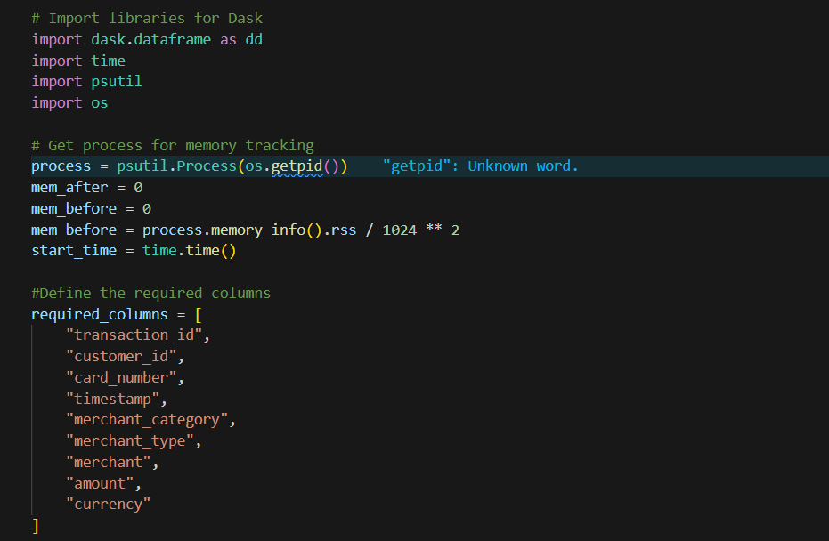

    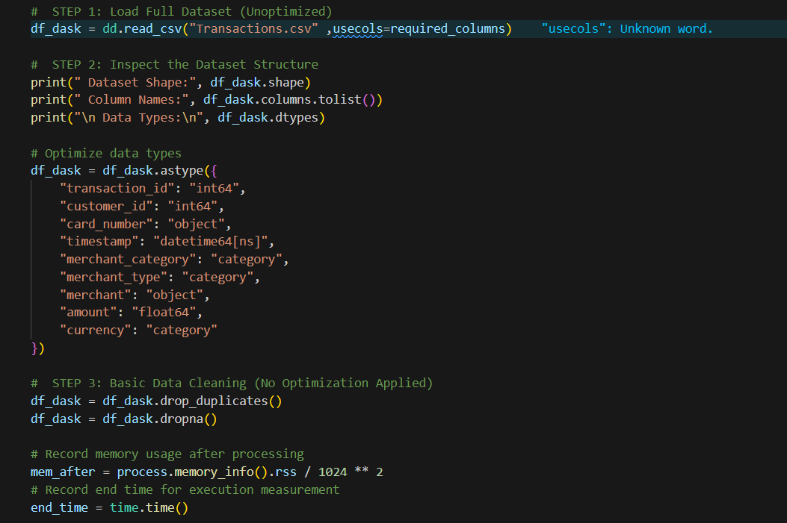

    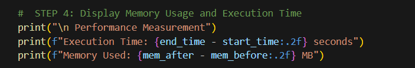
    
<strong>Figure 3.1: Dask optimization technique code</strong>

    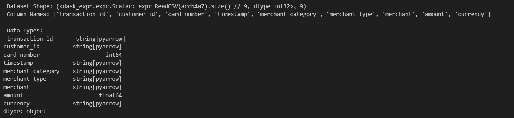

    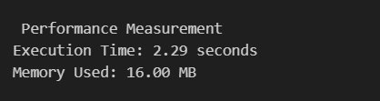
    
<strong>Figure 3.2: Dask performance</strong>

<strong>Summary</strong>

Using Dask, we efficiently loaded and preprocessed a large-scale financial transactions dataset by leveraging column selection and data type optimization. This approach resulted in substantial improvements in both memory usage and processing speed, making Dask highly suitable for big data analytics in the financial domain.

### Polars
The Polars library was chosen because of its efficient data handling in Python, especially when dealing with big data. Filtering at the level of the first CSV read was among the significant optimization strategies we utilized. Compared to Pandas, which loads the entire schema by default, Polars allows projection at the I/O level itself, which is very memory and I/O friendly.

The columns selected for analysis and optimization were:

- transaction_id
- customer_id
- card_number
- timestamp
- merchant_category
- merchant_type
- merchant
- amount
- currency

These fields were identified as the most relevant for analyzing transaction trends, merchant profiling, and supporting fraud detection use cases.

After loading the required columns, we performed data type optimization by converting:

- Categorical columns (merchant_category, merchant_type, currency) to Polars Categorical

- Numeric columns (amount) to Float64

- IDs and codes to string (for consistency)

- timestamp cleaned and parsed as a datetime field

These conversions aimed to further minimize memory usage while retaining full analytical utility.

Figures 3.3 and 3.4 present the full implementation using the Polars library, showcasing its effectiveness in handling and optimizing large-scale transaction datasets.

    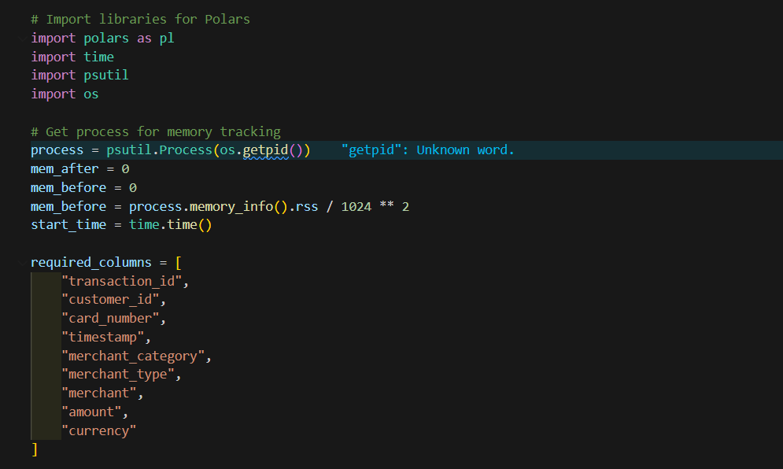

    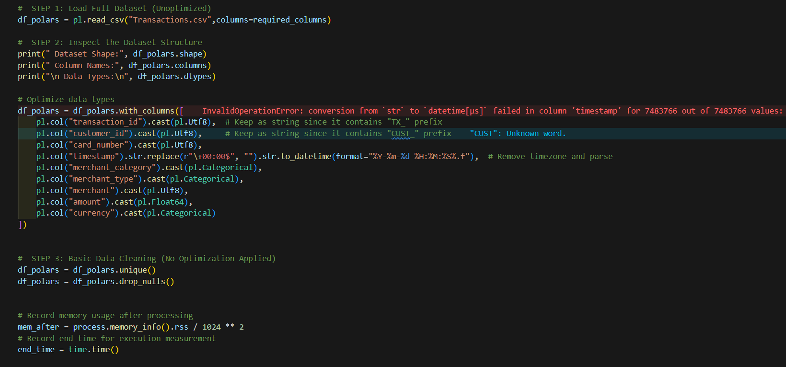

    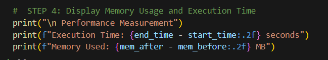
    
<strong>Figure 3.3: Polars optimization technique code</strong>

    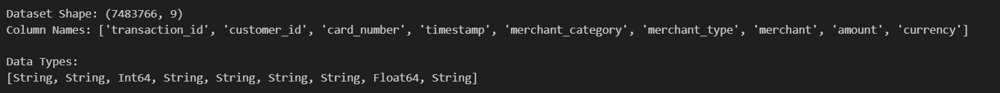

    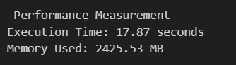
    
<strong>Figure 3.4: Polars performance</strong>

<strong>Summary</strong>

Using Polars, we efficiently loaded and processed a large-scale financial transactions dataset by applying column filtering and aggressive data type optimization. This led to major improvements in processing speed and memory utilization, proving Polars to be a powerful choice for scalable big data analytics in finance.

## Task 4: Comparative Analysis
This section compares the performance and usability of three approaches for handling large-scale financial transaction data:

- Traditional Method: Full load with Pandas
- Optimized Method 1: Dask (with column selection & type optimization)
- Optimized Method 2: Polars (with column selection & type optimization)

We evaluate each method based on memory usage, execution time, and ease of processing.

### Results Table

| Method  | Execution Time (seconds) | Memory Usage (MB) | Ease of Processing                              |
|---------|--------------------------|-------------------|-------------------------------------------------|
| Pandas  | 259.60                   | 1564.06           | Simple, familiar, but slow for big data         |
| Dask    | 2.29                     | 16.00             | Efficient, scalable, requires some setup        |
| Polars  | 17.87                    | 2425.53           | Very fast, modern, easy with column filter      |

    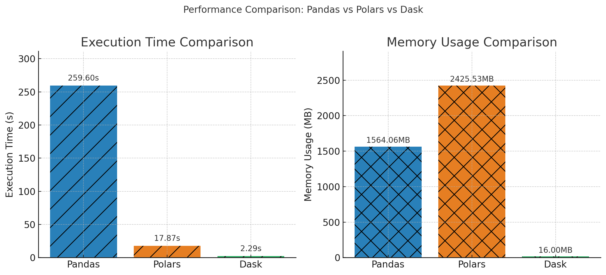

<strong>1. Memory Usage</strong>
   
- Pandas: Consumes significant memory as it loads the entire dataset into RAM. Can be a bottleneck for very large datasets.
- Dask: Extremely efficient memory usage due to lazy loading and partitioning. Only loads data as needed, ideal for big data.
- Polars: Fast and modern, but in this case used more memory than Pandas or Dask, likely due to how Polars buffers data and type conversions.

<strong>2. Execution Time</strong>
   
- Pandas: Much slower due to full in-memory loading and lack of parallelism.
- Dask: Fastest due to chunked, parallel processing and optimized reads.
- Polars: Also very fast, but slower than Dask here, possibly due to the complexity of type casting and additional internal processing.

<strong>3. Ease of Processing </strong>

- Pandas: Easiest for most users, but cannot handle huge data without running into resource issues.
- Dask: Familiar syntax for Pandas users, but requires setup and a shift to lazy computation mindset. Great for scaling up from Pandas.
- Polars: Intuitive and modern API, easy column projection and type optimization, but some advanced features (like string and datetime cleaning) may require learning new functions.

## Task 5: Conclusion & Reflection

### Conclusion

In this assignment, we compared Pandas, Dask, and Polars for handling a large-scale financial transactions dataset. Our results clearly show that traditional methods like Pandas struggle with performance and memory usage when dealing with big data. Optimized approaches using Dask and Polars provided significant improvements—Dask was the most efficient in terms of both speed and memory usage, while Polars delivered very fast processing with a modern interface.Choosing the right tool is crucial for big data analytics. For massive datasets, Dask or Polars should be preferred over Pandas. This project highlighted the value of big data libraries and practical optimization techniques in real-world data science workflows.

### Key Observations
- Dask outperformed both Pandas and Polars in terms of execution speed and memory efficiency for this large-scale financial transactions dataset.
- Pandas was the slowest and required a substantial amount of memory, making it less practical for big data tasks despite its ease of use and familiarity.
- Polars demonstrated impressive speed, but its memory usage was higher in this workflow compared to Dask. However, it provided a modern and flexible interface for data handling.

### Benefits and Limitations

| Method  | Speed         | Memory Efficiency | Best Use Case              |
|---------|--------------|-------------------|----------------------------|
| Pandas  | Slow         | High Memory Use   | Small/medium datasets      |
| Dask    | Fastest      | Most Efficient    | Large-scale data processing|
| Polars  | Very Fast    | High (varies)     | Fast analytics, big data   |

### Reflection
Through this assignment, we learned the importance of selecting the right data processing tool for big data analytics. While Pandas is excellent for small to moderate datasets and for rapid prototyping, it is not suitable for massive datasets due to its memory limitations and slow performance.

Dask and Polars both provided significant improvements. Dask is ideal for scaling existing Pandas workflows with minimal code changes, thanks to its familiar API and parallel computing capabilities. Polars offers a fresh approach with even faster performance and modern features but may require more adaptation and can use more memory depending on the use case.

Overall, we gained valuable hands-on experience with different Python big data libraries, learned practical optimization strategies (column filtering, data type optimization), and developed an appreciation for matching the right tool to the data challenge at hand.

