# 📊 SECP3133 – High Performance Data Processing (Section 02)

## 🧠 Assignment 2: Mastering Big Data Handling

> **Group AbaAba**  
> 👤 SOH HAN WEI — `A22EC0273`  
> 👤 MARCUS JOEY SAYNER — `A22EC0193`

---

 <h2>Task 1: Dataset Selection</h2>

  

    For this assignment, the selected dataset is <code>spotify_dataset.csv</code>, sourced from <strong>Kaggle</strong>, titled 
    "<strong>500K+ Spotify Songs with Lyrics, Emotions & More</strong>". This dataset offers a comprehensive compilation 
    of metadata and lyrical content for over <strong>900,000 songs</strong>, including audio features, emotional tagging, and artist information. 
    The file is approximately <strong>1.15 GB</strong>, which satisfies requirements for large-scale data processing tasks under real-world constraints.
  

  

    The dataset falls within the <strong>Music & Emotion Analytics</strong> domain. It integrates data science with musicology by offering insights into:
  

  <ul>
    <li>Lyrics and emotional content extracted using fine-tuned NLP models.</li>
    <li>Audio characteristics such as tempo, loudness, and key.</li>
    <li>Genre classification and contextual tags (e.g., party, chill, workout).</li>
  </ul>

  

    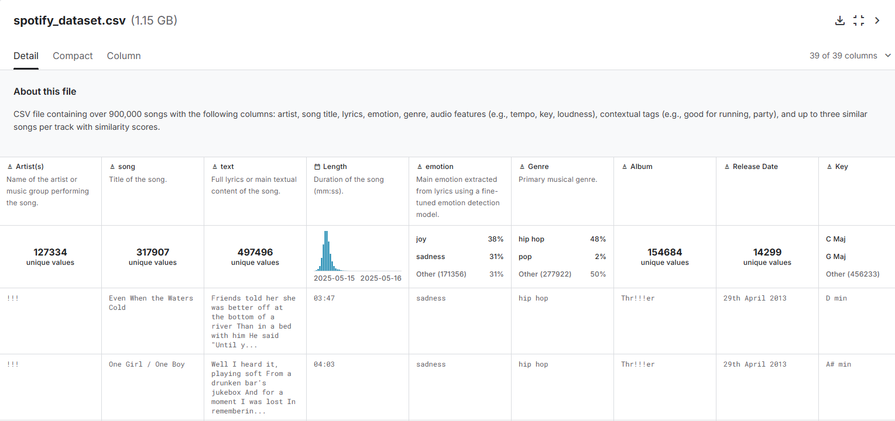
    
<strong>Figure 1.1:</strong> Overview of spotify_dataset.csv

  

  
The dataset consists of <strong>39 columns</strong> and <strong>551,479 rows</strong> of data.

  

    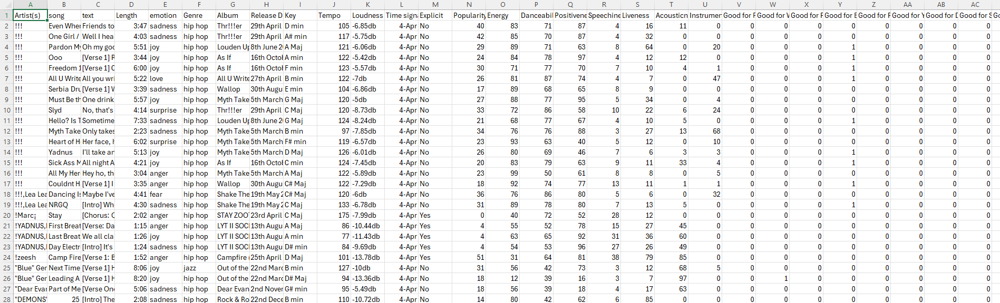
    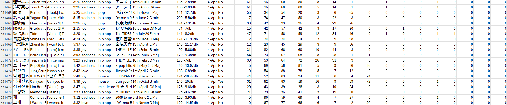
    
<strong>Figure 1.2:</strong> Data columns and row count from the CSV file

  

  <h2>Task 2: Load and Inspect Data</h2>

  
This task aims to load the complete dataset into memory using traditional <code>pandas</code>-based methods, conduct initial inspection, and evaluate the baseline performance in terms of execution time and memory consumption. This provides a reference point for comparison with optimized techniques in subsequent tasks.

  
Figure 2.1 shows how to sets up the kaggle API for downloads the <code>spotify_dataset.csv</code> datasets directly from Kaggle. Firstly, we enable the file upload function to uploads the <code>kaggle.json</code> file (Kaggle API credentials). This follow by sets up the <code>.kaggle</code> directory and securely copies the API key. Lastly, the <code>spotify_dataset.csv</code> was downloads and unzips.

  

    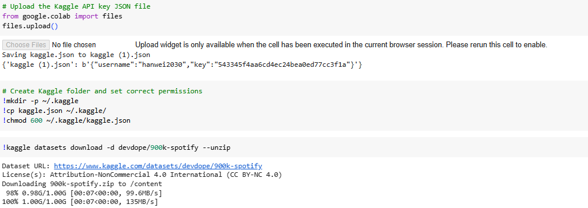
    
<strong>Figure 2.1:</strong> Kaggle Dataset Access and Configuration

  

  
Figure 2.2 shows we imported the required libraries to facilitate dataset handling and system resources monitoring. The current process was tracked using <code>psutil</code> to capture memory usage before and after loading the file. The variable <code>mem-before</code> stored the initial memory footprint (in megabytes), and <code>start_time</code> was used to record the beginning of the execution timer.

  

    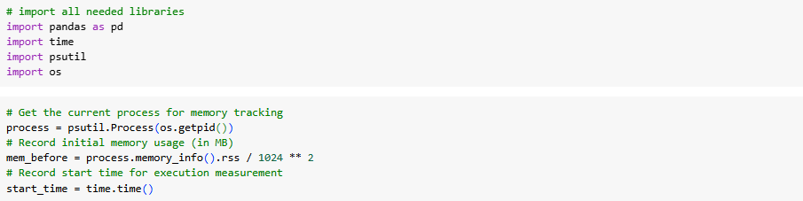
    
<strong>Figure 2.2:</strong> Library Import and Memory Tracker Setup

  

  
Figure 2.3 shows the dataset was fully downloaded into memory using <code>pandas.read_csv()</code> without any performance optimization. This approach, while straightforward, is computationally expensive when handling datasets over 1GB.

  

    
    
<strong>Figure 2.3:</strong> Load Full Dataset (Unoptimized)

  

  
Figure 2.4 shows the dataset structure was inspected by printing its shape, column names, and data types. This revealed a total of 551,443 rows and 39 columns, composed of object types, integers, and floating-point value representing song metadata, audio features, and emotion annotations.

  

    
    
<strong>Figure 2.4:</strong> Dataset Inspection

  

  
Figure 2.5 shows basic data cleaning was performed by removing duplicate entries using <code>drop_duplicates()</code> and eliminating rows with missing values <code>dropna()</code>.

  

    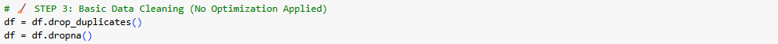
    
<strong>Figure 2.5:</strong> Basic Data Cleaning (Still Unoptimized)

  

  
Figure 2.6 shows post-processing performance metrics. <code>mem_after</code> recorded the memory usage after data loading and cleaning, while <code>end_time</code> marked the completion time. The difference in memory and time was printed to summarize the resource consumption of this traditional method.

  

    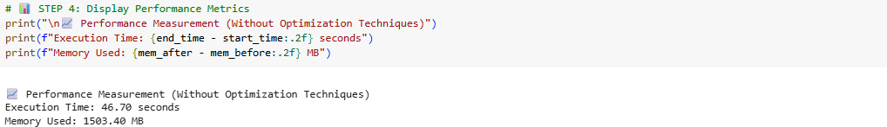
    
<strong>Figure 2.6:</strong> Record and Report Performance Metrics

  

  
  <h2>Task 3: Apply Big Data Handling Strategies</h2>

  
We had decided to implement <strong>Dask</strong> and <strong>Polars</strong> as our optimization libraries for handling this large-scale data.

  <h3><strong>Dask</strong></h3>

  The <code>Dask</code> library was selected for its ability to efficiently process large datasets through parallelism and lazy evaluation. One of the key optimization techniques applied was column-level filtering during the initial CSV read operation. Unlike <code>pandas</code>, which typically loads the entire dataset into memory, Dask allows for selective loading of only the required columns, significantly improving memory efficiency and I/O performance.

The columns selected for analysis and optimization were:

<ul>
<li>Genre</li>
<li>Popularity</li>
<li>Energy</li>
<li>Danceability</li>
<li>Tempo</li>
</ul>

These features were identified as highly relevant for analyzing music characteristics related to user engagement and genre-based trends in the Spotify dataset. After loading the selected columns, data type optimization was performed by converting:

Genre to category (to reduce string memory overhead), Popularity, Energy, and Danceability to int32, and Tempo to float32.

These conversions contributed to a substantial reduction in memory usage, while preserving the integrity of the data for analytical tasks.

Figures 3.3 and 3.4 present the full implementation using the Dask library, showcasing its effectiveness in handling and optimizing large-scale music datasets.

  

    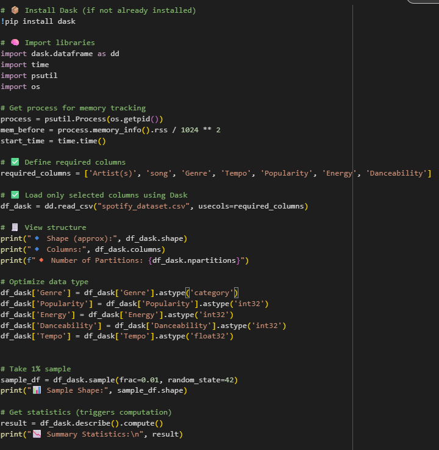
    
<strong>Figure 3.1:</strong> Dask optimization technique code

  

  

    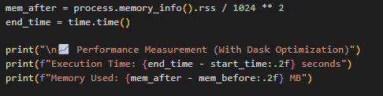
    
<strong>Figure 3.2:</strong> Dask performance

  

  <h3><strong>Polars</strong></h3>
  

    <code>Polars</code> library is chosen for its high-performance data handling capabilities in Python. We had applied column-level filtering during 
    the initial CSV read operation. Unlike <code>pandas</code>, which loads the full schema by default, Polars allows projection 
    (i.e., selective column loading) directly at the I/O level.
  

  
The selected columns were:

  <ul>
    <li>Artist(s)</li>
    <li>song</li>
    <li>text</li>
    <li>Length</li>
    <li>emotion</li>
    <li>Genre</li>
  </ul>

  

    These fields were identified as the most relevant for exploratory emotion-based analysis in the Spotify music domain.
  

  
Figure 3.3 and 3.4 show the full implementation of optimization library using Polars.

  

    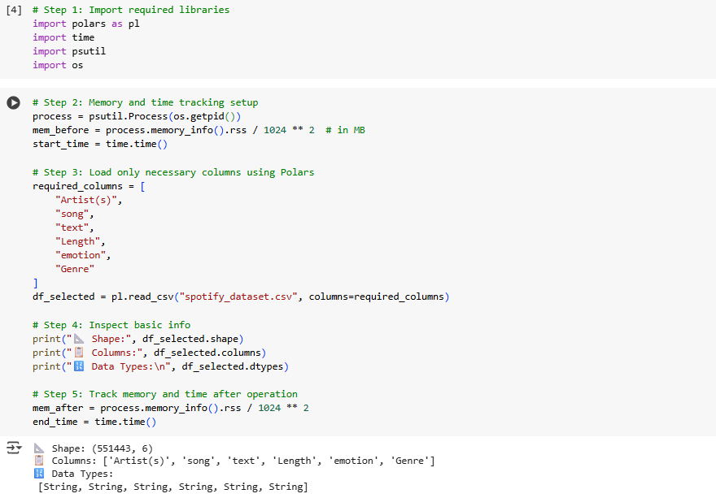
    
<strong>Figure 3.3:</strong> Polars optimization technique code

  

  

    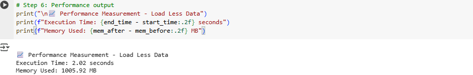
    
<strong>Figure 3.4:</strong> Polars performance

  

<h2>Task 4: Comparative Analysis</h2>

 To evaluate the efficiency of different data handling strategies, we compared the performance of traditional and optimized methods in terms of memory usage, execution time, and ease of processing. Three approaches were assessed: 
 <ul> <li><strong>Traditional Method</strong> using full load with <code>pandas.read_csv()</code></li> <li><strong>Dask Optimization</strong> with parallel processing and data type optimization</li> <li><strong>Polars Optimization</strong> with selective column loading and high-performance execution</li> </ul>
<strong>Performance Summary Table</strong>

 <table border="1" cellspacing="0" cellpadding="8"> <thead> <tr> <th>Method</th> <th>Execution Time (s)</th> <th>Memory Used (MB)</th> <th>Remarks</th> </tr> </thead> <tbody> <tr> <td>Traditional (Pandas)</td> <td>46.70</td> <td>1503.40</td> <td>Simple to implement but inefficient for large datasets.</td> </tr> <tr> <td>Dask (Optimized)</td> <td>248.10</td> <td>39.59</td> <td>Best memory efficiency but slower due to parallel task scheduling overhead.</td> </tr> <tr> <td>Polars (Load Less Data)</td> <td>2.02</td> <td>1005.92</td> <td>Extremely fast but memory usage depends on selected columns.</td> </tr> </tbody> </table> 

<strong>Analysis</strong>

<strong>Comparative Analysis Graph</strong>

 
Figure 4.1 and 4.2 show the comparative analysis graph between 3 libraries, which are Pandas, Dask, and Polars

  

    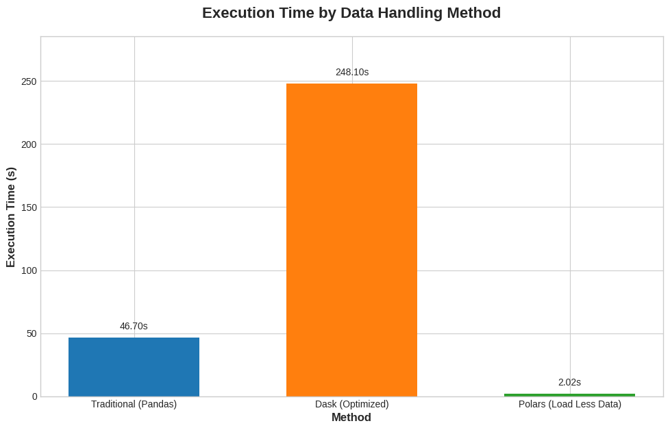
    
<strong>Figure 4.1:</strong> Execution Time by Data Handling Method

  

  

    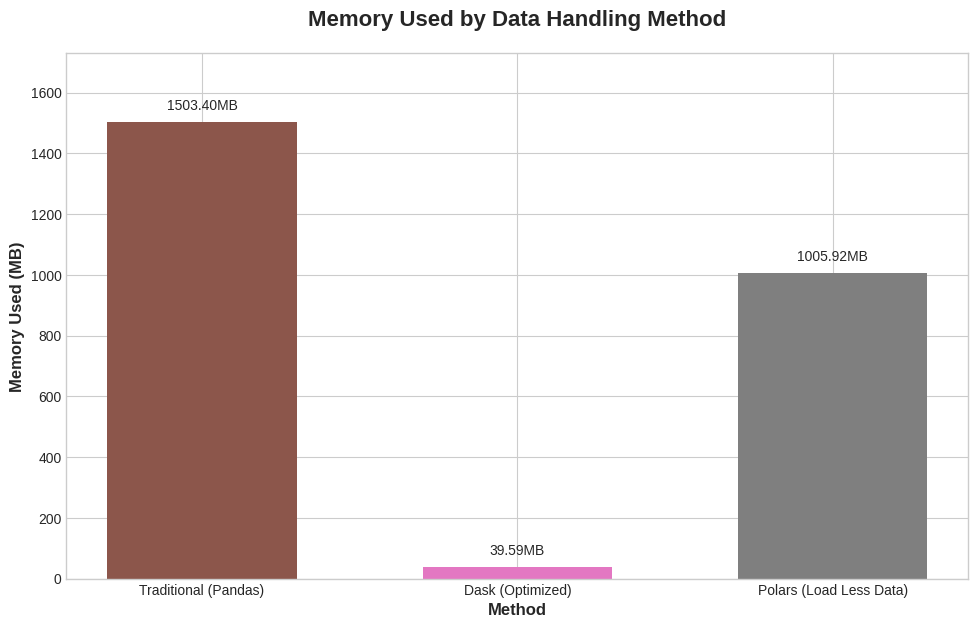
    
<strong>Figure 4.2:</strong> Memory Used by Data Handling Method

  

Pandas (Traditional): Despite being the most straightforward method, it consumed the highest memory and provided moderate performance in terms of speed.

Dask: Achieved massive memory savings (~97% less than Pandas) by loading only selected columns and optimizing data types. However, the execution time increased due to Dask’s overhead in managing task graphs and parallelism.

Polars: Demonstrated impressive speed (fastest among all) by leveraging its Rust-based engine and columnar data structure. Although memory usage was higher than Dask, it was significantly lower than Pandas and acceptable for most systems.

<h2>Task 5: Conclusion & Reflection</h2>
<strong>Conclusion</strong>

 Through this assignment, we explored various strategies to handle large datasets efficiently. We demonstrated how traditional methods using Pandas are easy to implement but struggle with memory constraints when working with large files. In contrast, modern libraries like Dask and Polars offer scalable solutions through parallel processing and selective loading. 
 
 Key takeaways: 
 <ul> <li><strong>Dask</strong> is ideal for memory-constrained environments, especially when only a subset of columns is needed.</li> <li><strong>Polars</strong> is optimal for high-speed processing when working with selected columns and medium-range memory usage is acceptable.</li> <li>Each optimization technique introduces trade-offs between memory, speed, and complexity.</li> </ul>
<strong>Reflection</strong>

 This assignment enhanced our understanding of big data management by applying real-world scalable techniques. We learned to: 
 <ul> <li>Profile system memory and track performance metrics using <code>psutil</code> and time functions.</li> <li>Use advanced libraries like Dask for distributed processing and Polars for high-speed data analysis.</li> <li>Balance trade-offs between different strategies to achieve efficient data loading and transformation.</li> </ul> 
 Moving forward, these skills will be valuable for tackling large-scale data challenges in industry applications and research-based data analytics. 

