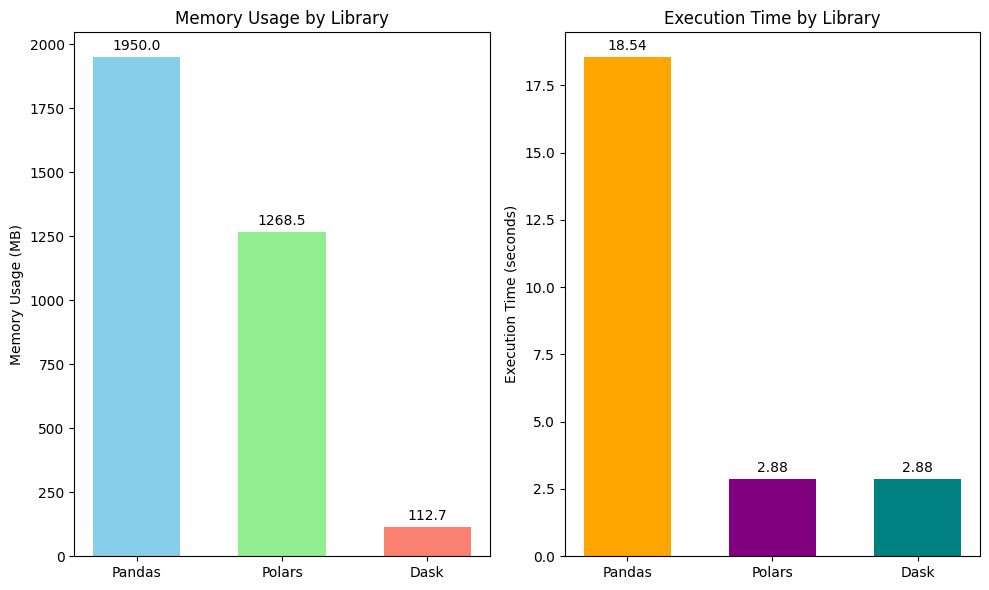

<h1>SECP3133 High Performance Data Processing - Section 02</h1>

<h2>Assignment 2 - Mastering Big Data Handling</h2>

<h3>Group Colab:</h3>
<ul>
<li><strong>Wong Qiao Ying</strong> - A22EC0118</li>
<li><strong>Nik Zulaikhaa Binti Zuraidi Afandi</strong> - A22EC0232</li>
</ul>

<h2>Task 1: Dataset Selection</h2>

### 1.1 Dataset Details
The title of the dataset we used is [**🎧 500K+ Spotify Songs with Lyrics,Emotions & More**](https://www.kaggle.com/datasets/devdope/900k-spotify) which is found on [Kaggle](https://www.kaggle.com/). This is a large-scale, music dataset with over 500,000 tracks. It includes lyrics, structured metadata, emotion labels, and more than 30 contextual and audio features per song. It was designed with AI applications in mind, particularly those involving music understanding, semantic search, and playlist generation.

### 1.2 Features Included
The dataset has a size of **1.36GB** and is featured with **8551443 rows x 39 columns** of data.
The columns included are:

  
<strong>Table 1: Column Description with Example</strong>

| Column Name                         | Description                                                              | Example                                |
|------------------------------------|---------------------------------------------------------------------------|----------------------------------------|
| Artist(s)                          | Name of the artist or music group performing the song.                   | !!!                                    |
| song                               | Title of the song.                                                       | Even When the Water's Cold             |
| text                               | Full lyrics or main textual content of the song.                         | "Friends told her she was better off…" |
| Length                             | Duration of the song (mm:ss).                                            | 03:47                                   |
| emotion                            | Main emotion extracted from lyrics using a fine-tuned emotion detection model. | sadness                             |
| Genre                              | Primary musical genre.                                                  | hip hop                                |
| Album                              | Name of the album.                                                      | Thr!!!er                                |
| Release Date                       | Release date of the track (DD/MM/YYYY).                                 | 29/04/2013                              |
| Key                                | Musical key of the song.                                                | D min                                   |
| Tempo                              | Tempo in BPM (may be normalized).                                       | 0.437869823                             |
| Loudness (db)                      | Loudness in decibels.                                                   | 0.785065407                             |
| Time signature                     | Beats per bar.                                                          | 4/4                                     |
| Explicit                           | Whether the track has explicit content.                                 | No                                      |
| Popularity                         | Popularity score.                                                       | 40                                      |
| Energy                             | Energy level (0–100).                                                   | 83                                      |
| Danceability                       | Danceability score (0–100).                                             | 71                                      |
| Positiveness                       | Valence or positivity score (0–100).                                    | 87                                      |
| Speechiness                        | Presence of spoken words (0–100).                                       | 4                                       |
| Liveness                           | Live performance probability (0–100).                                   | 16                                      |
| Acousticness                       | Acoustic level score (0–100).                                           | 11                                      |
| Instrumentalness                   | Instrumental likelihood (0–100).                                        | 0                                       |
| Good for Party                     | Suitable for party playlists (binary).                                  | 0                                       |
| Good for Work/Study                | Suitable for work/study (binary).                                       | 0                                       |
| Good for Relaxation/Meditation    | Suitable for relaxation (binary).                                       | 0                                       |
| Good for Exercise                  | Suitable for workout (binary).                                          | 0                                       |
| Good for Running                   | Suitable for running (binary).                                          | 0                                       |
| Good for Yoga/Stretching          | Suitable for yoga/stretching (binary).                                  | 0                                       |
| Good for Driving                   | Suitable for driving (binary).                                          | 0                                       |
| Good for Social Gatherings        | Suitable for social events (binary).                                    | 0                                       |
| Good for Morning Routine          | Suitable for mornings (binary).                                         | 0                                       |
| Similar Artist 1                  | First most similar artist.                                              | Corey Smith                            |
| Similar Song 1                    | First similar song.                                                     | If I Could Do It Again                 |
| Similarity Score 1                | Similarity score (0–1).                                                 | 0.986060785                             |
| Similar Artist 2                  | Second most similar artist.                                             | Toby Keith                             |
| Similar Song 2                    | Second similar song.                                                    | Drinks After Work                      |
| Similarity Score 2                | Similarity score (0–1).                                                 | 0.983719477                             |
| Similar Artist 3                  | Third most similar artist.                                              | Space                                  |
| Similar Song 3                    | Third similar song.                                                     | Neighbourhood                          |
| Similarity Score 3                | Similarity score (0–1).                                                 | 0.983236351                             |

<h2>Task 2: Load and Inspect Data</h2>

In this task, the Spotify dataset was downloaded using KaggleHub in Google Colab, loaded into memory using Pandas, and inspected to understand its structure. Additionally, we performed basic preprocessing by standardizing selected numerical columns for future analysis.

  
  
<strong>Figure 2.1:</strong> Kaggle Installation

After installing the necessary package, we used KaggleHub to download the dataset automatically. This helped avoid the need for manual downloads.

  
  
<strong>Figure 2.2:</strong> Kaggle Data Download Process

Once downloaded, we located the dataset path and listed the files to verify the successful download of <code>spotify_dataset.csv</code>.

  
  
<strong>Figure 2.3:</strong> Locating and Listing Downloaded Files

The dataset was then loaded into memory using <code>pd.read_csv()</code>, which is efficient for small to medium-sized datasets. We also recorded performance metrics as follows:

<ul>
  <li>⏱️ Execution Time: 37.09 seconds</li>
  <li>📦 Memory Usage: 1950.00 MB MB</li>
</ul>

  
  
<strong>Figure 2.4:</strong> Loading Dataset Using Pandas

After loading the dataset, we performed a basic inspection to understand its structure and contents. This included:

<ul>
  <li>Displaying the shape and column names of the dataset</li>
  <li>Reviewing data types</li>
  <li>Checking for missing values</li>
</ul>

  
  
<strong>Figure 2.5:</strong> Basic Data Inspection using Pandas

 

We standardized the following numerical columns using <code>StandardScaler</code> from <code>sklearn.preprocessing</code> to ensure consistent scaling for further analysis:

<ul>
  <li>Similarity Score 1</li>
  <li>Similarity Score 2</li>
  <li>Similarity Score 3</li>
</ul>

  
  
<strong>Figure 2.6:</strong> Standardizing Numerical Features

<h3>✅ Summary</h3>

By the end of this task, the Spotify dataset was:

<ul>
  <li>✅ Successfully retrieved using KaggleHub</li>
  <li>✅ Loaded into memory using Pandas</li>
  <li>✅ Inspected for structural understanding</li>
  <li>✅ Preprocessed with standardized numerical features</li>
</ul>

This forms the baseline for comparing performance with other frameworks like Polars and Dask in later tasks.

<h2>Task 3: Handling Big Data Strategies</h2>

In this task, we explored and implemented several strategies to efficiently handle the Spotify dataset, especially considering its large size. The techniques applied include:

<ul>
  <li>Loading only necessary data columns</li>
  <li>Chunking data during the loading phase</li>
  <li>Optimizing data types</li>
  <li>Sampling to reduce dataset size</li>
</ul>

 

<h3>✅ Step 1: Load Less Data</h3>

We first identified and excluded unnecessary columns to reduce memory usage and improve load time.

  
  
<strong>Figure 3.1:</strong> Loading Selected Columns Only

<ul>
  <li>📦 Memory Usage: <code>1790.17 MB</code></li>
  <li>⏱️ Load Time: <code>21.1007 sec</code></li>
</ul>

 

<h3>✅ Step 2: Chunking</h3>

To further optimize loading, we used chunking to process the data in manageable parts.

  
  
<strong>Figure 3.2:</strong> Loading Data in Chunks

<ul>
  <li>📦 Memory Usage: <code>1950.00 MB</code></li>
  <li>⏱️ Load Time: <code>21.6816 sec</code></li>
</ul>

 

<h3>✅ Step 3: Optimize Data Types</h3>

We optimized data types by converting object columns to category types and downcasting numeric columns. This significantly reduced memory usage.

  
  
<strong>Figure 3.3:</strong> Data Type Optimization

<ul>
  <li>📦 Memory Usage: <code>1766.80 MB</code></li>
  <li>⏱️ Load Time: <code>21.6686 sec</code></li>
  <li>⚙️ Optimization Time: <code>10.7711 sec</code></li>
</ul>

 

<h3>✅ Step 4: Sampling</h3>

Finally, we performed sampling to reduce the dataset size to 10% of its original volume, maintaining a representative subset for further analysis.

  
  
<strong>Figure 3.4:</strong> Sampling 10% of the Dataset

<ul>
  <li>📦 Memory Usage After Sampling: <code>196.08 MB</code></li>
  <li>⏱️ Load Time (Full Dataset): <code>25.0614 sec</code></li>
  <li>⏱️ Sampling Time: <code>0.5254 sec</code></li>
  <li>⚙️ Processing Time (Scaling): <code>0.001819372 sec</code></li>
</ul>

 

<h3>✅ Summary</h3>

Through these strategies, we effectively reduced memory usage and optimized data handling for large datasets in Pandas. Key improvements include:

<ul>
  <li>✅ Reduced memory usage through selective column loading and data type optimization</li>
  <li>✅ Efficient data processing via chunking</li>
  <li>✅ Reduced dataset size for faster and more manageable analysis through sampling</li>
</ul>

These steps provide a robust foundation for scaling data analysis and comparisons with other frameworks like Polars and Dask.

<h2>Task 4: Comparative Analysis</h2>

### 4.1 Loading Dataset
The raw dataset is loaded using Pandas, Polars, and Dask library in different runs. During the loading process, the performance for each load is calculated and visualized in graphs for comparison. Memory usage is measured in Megabyte (MB) whereas the execution time is measured in seconds (s). 
 

Figure 4.1 displays the full coding to load dataset using Pandas library. The memory usage is **1950.00MB** whereas the execution time is **18.54s**.

  
  
<strong>Figure 4.1:</strong> Loading full dataset using Pandas

 

Figure 4.2 displays the full coding to load dataset using Polars library. The memory usage is **1268.51MB** whereas the execution time is **2.88s**.

  
  
<strong>Figure 4.2:</strong> Loading full dataset using Polars

 

Figure 4.3 displays the full coding to load dataset using Dask library. The memory usage is **112.7MB** whereas the execution time is **2.88s**.

  
  
<strong>Figure 4.3:</strong> Loading full dataset using Dask

 

Table 2 displays the summary of performance of each library in tables for easier understanding.

  
<strong>Table 2:</strong> Performance of Pandas, Polars, and Dask for Full Dataset Loading

| Library  | Memory Usage (MB) | Execution Time (s) |
|----------|-------------------|--------------------|
| Pandas   | 1950.00           | 18.54              |
| Polars   | 1268.51           | 2.88               |
| Dask     | 112.7             | 2.88               |

### 4.2 Comparison between Three Libraries
Figure 4.4 displays the bar charts that illustrate the comparative performance of Pandas, Polars, and Dask in terms of memory usage and execution time during dataset loading operations. As observed in the **Memory Usage** chart, Pandas demonstrates the highest memory consumption at **1950 MB**, which reflects its eager, single-threaded loading strategy that requires the entire dataset to reside in memory. In contrast, Polars exhibits more efficient memory handling, consuming **1268.5 MB**. This improvement is largely due to Polars’ columnar data format and native multithreaded execution implemented in Rust, which enable more compact and cache-friendly data representation.

Dask shows the most minimal memory footprint at **112.7 MB**, a result of its lazy evaluation and partitioned data reading. Rather than loading the entire dataset at once, Dask processes the data in manageable chunks, significantly reducing memory overhead at the initial loading stage. However, it is important to acknowledge that this figure may increase during full computation phases involving `.compute()` or aggregation tasks.

The **Execution Time** chart further reinforces the performance disparity among the libraries. Pandas records the longest execution time of **18.54 seconds**, aligning with its known limitations in scalability and parallel processing. Polars and Dask complete the loading process in a mere **2.88 seconds**, highlighting their superior speed and scalability. Polars achieves this through optimized memory access patterns and low-level system efficiency, while Dask leverages concurrent processing across partitions to reduce bottlenecks.

  
  
<strong>Figure 4.4:</strong> Performace Bar Chart of Pandas, Polars, and Dask for Full Dataset Loading

In addition to performance metrics, ease of processing is a critical factor in selecting an appropriate data processing library. Pandas is widely regarded as the most user-friendly among the three due to its extensive documentation, large community support, and intuitive API. Its syntax is straightforward and familiar to most Python users, making it an excellent choice for beginners and rapid prototyping. Most tutorials, examples, and industry codebases rely on Pandas, which further contributes to its accessibility.

Polars, while newer, offers a familiar syntax that closely resembles Pandas but introduces some differences due to its lazy execution model and expression-based transformations. Users may experience a slight learning curve when adapting to Polars' query syntax, especially for complex data transformations. However, once mastered, Polars provides both clarity and performance benefits. Its growing documentation and active development community are making it increasingly approachable.

Dask, on the other hand, is more complex to work with due to its distributed computing paradigm and lazy evaluation strategy. Although Dask mimics the Pandas API, users must be aware of when computations are deferred and explicitly call .compute() to trigger execution. This adds a layer of complexity, especially when debugging or chaining multiple operations. Furthermore, configuring Dask for multi-core or cluster environments can be non-trivial for users unfamiliar with parallel processing.

In summary, the graphical analysis clearly demonstrates that **Polars and Dask significantly outperform Pandas** in both execution speed and memory efficiency. These findings suggest that for large-scale data processing tasks, Polars and Dask are the preferred tools due to their architectural advantages and ability to handle high-volume data more effectively.

 
<h2>Task 5: Conclusion & Reflection</h2>

✅ Conclusion  
In conclusion, through this assignment, we explored a comprehensive workflow for big data handling—from dataset selection and preprocessing to performance evaluation across modern Python data libraries. The Spotify dataset offered a rich, complex environment to benchmark the three libraries:

- **Pandas:** Best for small-to-medium datasets with excellent ease of use and rapid prototyping.
- **Polars:** Delivers impressive speed and memory efficiency for single-node processing, with a syntax reminiscent of Pandas.
- **Dask:** Ideal for very large datasets and distributed computing, though it requires more attention to task execution and environment setup.

These insights not only highlight the trade-offs between libraries but also emphasize the importance of choosing the right tool based on project scale and complexity. Going forward, these techniques can be extended to larger or more specialized data processing tasks, ensuring efficient and scalable analytics workflows.

✅ Reflection  

**Wong Qiao Ying**

  
**Nik Zulaikhaa Binti Zuraidi Afandi**

Through this task, I deepened my understanding of modern data processing tools and their performance differences. Working with the Spotify dataset challenged me to consider memory usage, processing time, and API nuances. This experience will guide my decisions in future projects, especially when dealing with large or distributed data environments.

