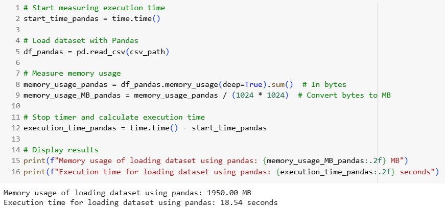
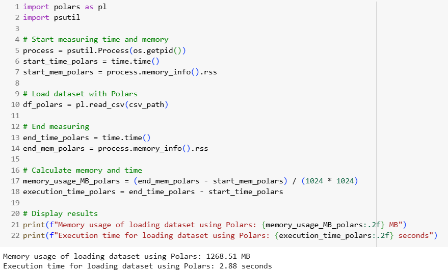
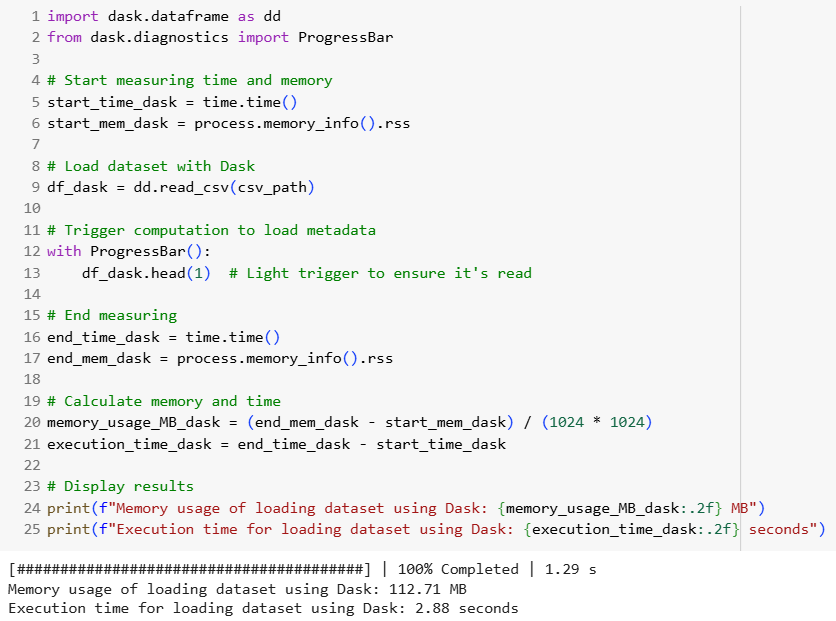

<h1>SECP3133 High Performance Data Processing - Section 02</h1>

<h2>Assignment 2 - Mastering Big Data Handling</h2>

<h3>Group Colab:</h3>
<ul>
<li><strong>Wong Qiao Ying</strong> - A22EC0118</li>
<li><strong>Nik Zulaikhaa Binti Zuraidi Afandi</strong> - A22EC0232</li>
</ul>

<h2>💽 Task 1: Dataset Selection</h2>

### 📇 1.1 Dataset Details
The title of the dataset we used is [**🎧 500K+ Spotify Songs with Lyrics,Emotions & More**](https://www.kaggle.com/datasets/devdope/900k-spotify) which is found on [Kaggle](https://www.kaggle.com/). This is a large-scale, music dataset with over 500,000 tracks. It includes lyrics, structured metadata, emotion labels, and more than 30 contextual and audio features per song. It was designed with AI applications in mind, particularly those involving music understanding, semantic search, and playlist generation.

### 🖲️ 1.2 Features Included
The dataset has a size of **1.36GB** and is featured with **8551443 rows x 39 columns** of data.
The columns included are:

  
<strong>Table 1: Column Description with Example</strong>

| Column Name                         | Description                                                              | Example                                |
|------------------------------------|---------------------------------------------------------------------------|----------------------------------------|
| Artist(s)                          | Name of the artist or music group performing the song.                   | !!!                                    |
| song                               | Title of the song.                                                       | Even When the Water's Cold             |
| text                               | Full lyrics or main textual content of the song.                         | "Friends told her she was better off…" |
| Length                             | Duration of the song (mm:ss).                                            | 03:47                                   |
| emotion                            | Main emotion extracted from lyrics using a fine-tuned emotion detection model. | sadness                             |
| Genre                              | Primary musical genre.                                                  | hip hop                                |
| Album                              | Name of the album.                                                      | Thr!!!er                                |
| Release Date                       | Release date of the track (DD/MM/YYYY).                                 | 29/04/2013                              |
| Key                                | Musical key of the song.                                                | D min                                   |
| Tempo                              | Tempo in BPM (may be normalized).                                       | 0.437869823                             |
| Loudness (db)                      | Loudness in decibels.                                                   | 0.785065407                             |
| Time signature                     | Beats per bar.                                                          | 4/4                                     |
| Explicit                           | Whether the track has explicit content.                                 | No                                      |
| Popularity                         | Popularity score.                                                       | 40                                      |
| Energy                             | Energy level (0–100).                                                   | 83                                      |
| Danceability                       | Danceability score (0–100).                                             | 71                                      |
| Positiveness                       | Valence or positivity score (0–100).                                    | 87                                      |
| Speechiness                        | Presence of spoken words (0–100).                                       | 4                                       |
| Liveness                           | Live performance probability (0–100).                                   | 16                                      |
| Acousticness                       | Acoustic level score (0–100).                                           | 11                                      |
| Instrumentalness                   | Instrumental likelihood (0–100).                                        | 0                                       |
| Good for Party                     | Suitable for party playlists (binary).                                  | 0                                       |
| Good for Work/Study                | Suitable for work/study (binary).                                       | 0                                       |
| Good for Relaxation/Meditation    | Suitable for relaxation (binary).                                       | 0                                       |
| Good for Exercise                  | Suitable for workout (binary).                                          | 0                                       |
| Good for Running                   | Suitable for running (binary).                                          | 0                                       |
| Good for Yoga/Stretching          | Suitable for yoga/stretching (binary).                                  | 0                                       |
| Good for Driving                   | Suitable for driving (binary).                                          | 0                                       |
| Good for Social Gatherings        | Suitable for social events (binary).                                    | 0                                       |
| Good for Morning Routine          | Suitable for mornings (binary).                                         | 0                                       |
| Similar Artist 1                  | First most similar artist.                                              | Corey Smith                            |
| Similar Song 1                    | First similar song.                                                     | If I Could Do It Again                 |
| Similarity Score 1                | Similarity score (0–1).                                                 | 0.986060785                             |
| Similar Artist 2                  | Second most similar artist.                                             | Toby Keith                             |
| Similar Song 2                    | Second similar song.                                                    | Drinks After Work                      |
| Similarity Score 2                | Similarity score (0–1).                                                 | 0.983719477                             |
| Similar Artist 3                  | Third most similar artist.                                              | Space                                  |
| Similar Song 3                    | Third similar song.                                                     | Neighbourhood                          |
| Similarity Score 3                | Similarity score (0–1).                                                 | 0.983236351                             |

<h2>Task 2: Load and Inspect Data</h2>

In this task, the Spotify dataset was downloaded using KaggleHub in Google Colab, loaded into memory using Pandas, and inspected to understand its structure. Additionally, we performed basic preprocessing by standardizing selected numerical columns for future analysis.

  
  
<strong>Figure 2.1:</strong> Kaggle Installation

After installing the necessary package, we used KaggleHub to download the dataset automatically. This helped avoid the need for manual downloads.

  
  
<strong>Figure 2.2:</strong> Kaggle Data Download Process

Once downloaded, we located the dataset path and listed the files to verify the successful download of <code>spotify_dataset.csv</code>.

  
  
<strong>Figure 2.3:</strong> Locating and Listing Downloaded Files

The dataset was then loaded into memory using <code>pd.read_csv()</code>, which is efficient for small to medium-sized datasets. We also recorded performance metrics as follows:

<ul>
  <li>⏱️ Execution Time: 37.09 seconds</li>
  <li>📦 Memory Usage: 1950.00 MB MB</li>
</ul>

  
  
<strong>Figure 2.4:</strong> Loading Dataset Using Pandas

After loading the dataset, we performed a basic inspection to understand its structure and contents. This included:

<ul>
  <li>Displaying the shape and column names of the dataset</li>
  <li>Reviewing data types</li>
  <li>Checking for missing values</li>
</ul>

  
  
<strong>Figure 2.5:</strong> Basic Data Inspection using Pandas

 

We standardized the following numerical columns using <code>StandardScaler</code> from <code>sklearn.preprocessing</code> to ensure consistent scaling for further analysis:

<ul>
  <li>Similarity Score 1</li>
  <li>Similarity Score 2</li>
  <li>Similarity Score 3</li>
</ul>

  
  
<strong>Figure 2.6:</strong> Standardizing Numerical Features

<h3>✅ Summary</h3>

By the end of this task, the Spotify dataset was:

<ul>
  <li>✅ Successfully retrieved using KaggleHub</li>
  <li>✅ Loaded into memory using Pandas</li>
  <li>✅ Inspected for structural understanding</li>
  <li>✅ Preprocessed with standardized numerical features</li>
</ul>

This forms the baseline for comparing performance with other frameworks like Polars and Dask in later tasks.

<h2>Task 3: Apply Big Data Handling Strategies</h2>

<h2>Task 4: Comparative Analysis</h2>
The raw dataset is loaded using Pandas, Polars, and Dask library in different runs. During the loading process, the performance for each load is calculated and visualized in graphs for comparison. Memory usage is measured in Megabyte (MB) whereas the execution time is measured in seconds (s). 
 

Figure 4.1 displays the full coding to load dataset using Pandas library. The memory usage is **1950.00MB** whereas the execution time is **18.54s**.

  
  
<strong>Figure 4.1:</strong> Loading full dataset using Pandas

 

Figure 4.2 displays the full coding to load dataset using Polars library. The memory usage is **1268.51MB** whereas the execution time is **2.88s**.

  
  
<strong>Figure 4.2:</strong> Loading full dataset using Polars

 

Figure 4.3 displays the full coding to load dataset using Dask library. The memory usage is **112.7MB** whereas the execution time is **2.88s**.

  
  
<strong>Figure 4.3:</strong> Loading full dataset using Dask

 

Table 2 displays the summary of performance of each library in tables for easier understanding.

  
<strong>Table 2:</strong> Performance of Pandas, Polars, and Dask for Full Dataset Loading

| Library  | Memory Usage (MB) | Execution Time (s) |
|----------|-------------------|--------------------|
| Pandas   | 1950.00           | 18.54              |
| Polars   | 1268.51           | 2.88               |
| Dask     | 112.7             | 2.88               |

<h2>Task 5: Conclusion & Reflection</h2>

