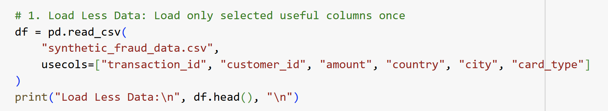
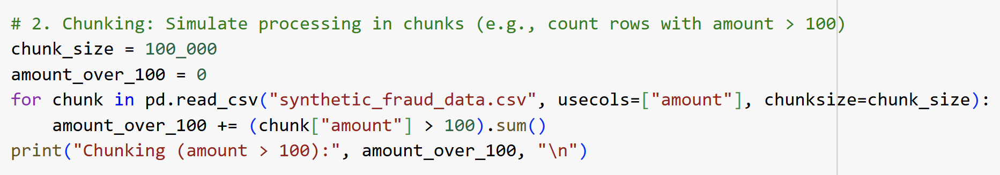
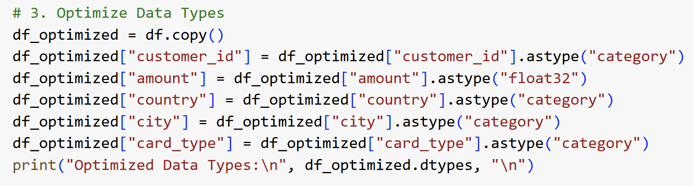
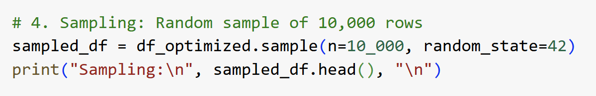
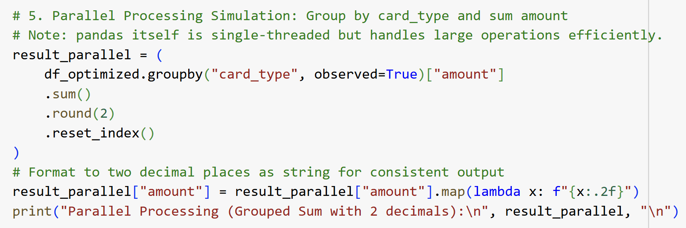

<h1>SECP3133 High Performance Data Processing - Section 02</h1>

<h2>Assignment 2 - Mastering Big Data Handling</h2>

<h3>Group DataStorm:</h3>
<ul>
<li><strong>NUR FARAH ADIBAH BINTI IDRIS</strong> - A22EC0245</li>
<li><strong>NUR ALEYSHA QURRATU'AINI BINTI MAT SALLEH</strong> - A22EC0241</li>
</ul>

<h2>Introduction</h2>
In the era of digital transformation, massive volumes of data are generated every second across various sectors, especially in financial systems where transaction records are essential. This project focuses on the analysis and processing of a large-scale synthetic fraud detection dataset. The dataset, which simulates real-world transactional data, requires efficient big data handling techniques to ensure optimal performance during exploration and analysis.
  

Given the scale and complexity of the dataset, traditional data processing methods may become inefficient or even infeasible. Therefore, modern Python-based libraries such as **Pandas**, **Dask**, and **Polars** are utilized in this project. These libraries offer robust functionalities for memory optimization, parallel processing, and efficient data handling. The aim is to apply a series of strategies to manage and process the dataset effectively while preserving the integrity and usability of the information.

<h2>Objectives</h2>
<ul>
<li>To apply multiple big data handling strategies including loading less data, chunking, sampling, type optimization, and parallel processing.</li>
<li>To compare performance of Pandas, Dask, and Polars in terms of memory usage and execution time.</li>
</ul>

<h2>Task 1: Dataset Selection</h2>
<h3>Dataset Description</h3>
The dataset selected for this assignment is a synthetically generated financial transactions dataset, designed to closely mimic real-world consumer behavior while maintaining data privacy. It was created using Python to support the development and evaluation of fraud detection models. The dataset includes a wide variety of transaction types across categories such as retail, groceries, dining, healthcare, entertainment, and travel, allowing for comprehensive analysis of legitimate and fraudulent activities.
 
 
Each transaction entry is accompanied by detailed attributes including:
- transaction amount
- timestamp
- merchant details
- card type
- customer device
- location
- an indicator specifying whether the transaction is fraudulent.

It also incorporates geographic diversity (e.g., multiple countries and currencies) and customer profile data (e.g., account age and device preference), which are critical for understanding transactional risk factors.

- **Source:** [Transactions – Synthetic Fraud Detection Data](https://www.kaggle.com/datasets/ismetsemedov/transactions)
- **File Size:** 2.93GB
- **Total Rows:** 7,483,766
- **Total Columns:** 24

Figure 1.0 shows the preview of the dataset from Kaggle.

    
    
<strong>Figure 1.0: Preview of synthetic_fraud_data.csv</strong>

  

<h2>Task 2: Load and Inspect Data</h2>
The selected dataset was loaded and initial inspection of the dataset was performed in order to understand its structure. This step served as a foundation of for applying big data handling techniques in later tasks.  
 
As shown in Figure 2.1, the process began by setting up the environment in Google Colab, where the Kaggle API was configured using the `kaggle.json` file to enable automated dataset downloading. After downloading and unzipping the dataset file (`synthetic_fraud_data.csv`), the Pandas library was used to load the entire dataset into memory.

    
    
<strong>Figure 2.1: Load Dataset Into Memory</strong>

  

Next, the fundamental metadata such as shape, column names, and data types was extracted to understand the data schema and distribution. Figure 2.2 illustrates the process of the data inspection. The `psutil` and `time` libraries were implemented to measure memory consumption and execution time before and after loading. Once loaded, the data was inspected to determine its dimension using `.shape`, list all column names using `.columns`, and identify data types of each column through `.dtypes`. The `.head()` function was used to preview the first few records. These steps provided an overview of the dataset, which consists of over 7 million rows and 24 features. This task was essential in understanding the scale of the data and set a performance baseline for evaluating the efficiency of future optimization techniques. 

    
    
<strong>Figure 2.2: Data Inspection</strong>

  

<h2>Task 3: Apply Big Data Handling Strategies</h2>

The objective of this task was to apply strategies to handle and process large datasets using Python. Given the substantial size of the dataset, traditional data loading and manipulation could lead to excessive memory consumption and long execution times. In order to address this issue, five big data strategies were implemented using three libraries, which are **Pandas**, **Dask**, and **Polars**. The strategies include, loading less data, chunking, optimizing data types, sampling, and parallel processing. These strategies helped reduce memory usage, improve performance, and prepare the dataset for future analysis. 

<h3>3.1 Pandas</h3>
<h4>3.1.1 Load Less Data</h4>

Figure 3.1.1 shows that only six essential columns (`transaction_id` , `customer_id`, `amount`, `country`, `city`, `card_type`) were selected during data loading using the usecols parameter in read_csv(). This reduced the amount of data read into memory and minimized unnecessary processing.

    
    
<strong>Figure 3.1.1: Load Less Data using Pandas</strong>

  

<h4>3.1.2 Chunking</h4>

As shown in Figure 3.1.2, The dataset was processed in chunks of 100,000 rows using `read_csv(chunksize=...)`. An operation was performed to count the number of transactions where the amount exceeded 100. This strategy allowed large datasets to be processed incrementally without overloading memory.

    
    
<strong>Figure 3.1.2: Chunking using Pandas</strong>

<h4>3.1.3 Optimize Data Types</h4>

Refer to Figure 3.1.3, in order to reduce memory usage, categorical columns like customer_id, country, city, and card_type were converted to the `category` data type, and the amount column was cast to `float32`. These conversions reduced the dataset’s overall memory footprint.

    
    
<strong>Figure 3.1.3: Optimize Data Types using Pandas</strong>

<h4>3.1.4 Sampling</h4>

Figure 3.1.4 demostrate that a random sample of 10,000 rows was selected using `.sample(n=10000)`. This enabled quicker testing and prototyping on a manageable subset of the full dataset.

    
    
<strong>Figure 3.1.4: Sampling using Pandas</strong>

<h4>3.1.5 Parallel Processing (Aggregation)</h4>

As shown in Figure 3.1.5, Group-by aggregation was performed using `groupby("card_type")["amount"].sum()` to compute the total transaction amount per card type. Although Pandas is single-threaded, it handled the operation effectively on the optimized dataset. The result was rounded and formatted to display two decimal places.

    
    
<strong>Figure 3.1.2: Parallel Processing (Aggregation) using Pandas</strong>

<h2>Task 4: Comparative Analysis</h2>
Figure 4.0 shows the performance comparison of data processing libraries

<h2>Task 5: Conclusion & Reflection</h2>

