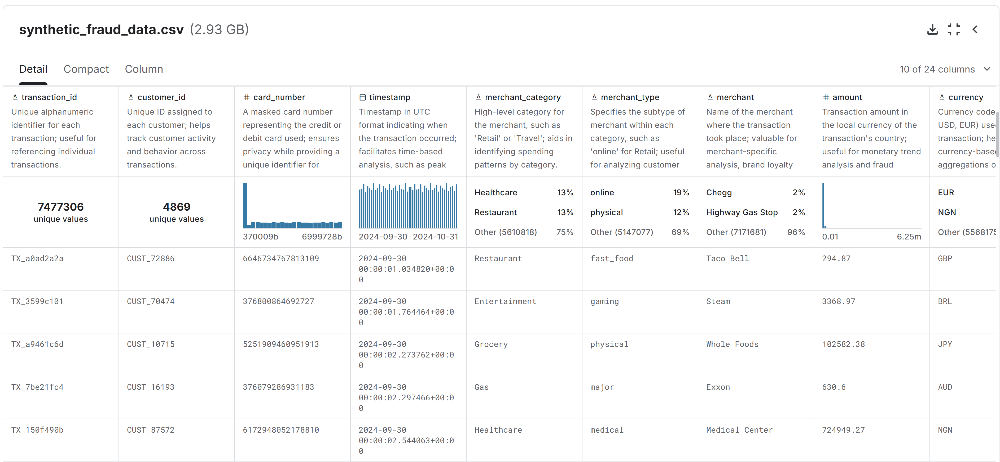

<h1>SECP3133 High Performance Data Processing - Section 02</h1>

<h2>Assignment 2 - Mastering Big Data Handling</h2>

<h3>Group DataStorm:</h3>
<ul>
<li><strong>NUR FARAH ADIBAH BINTI IDRIS</strong> - A22EC0245</li>
<li><strong>NUR ALEYSHA QURRATU'AINI BINTI MAT SALLEH</strong> - A22EC0241</li>
</ul>

<h2>Introduction</h2>
In the era of digital transformation, massive volumes of data are generated every second across various sectors, especially in financial systems where transaction records are essential. This project focuses on the analysis and processing of a large-scale synthetic fraud detection dataset. The dataset, which simulates real-world transactional data, requires efficient big data handling techniques to ensure optimal performance during exploration and analysis.

Given the scale and complexity of the dataset, traditional data processing methods may become inefficient or even infeasible. Therefore, modern Python-based libraries such as **Pandas**, **Dask**, and **Polars** are utilized in this project. These libraries offer robust functionalities for memory optimization, parallel processing, and efficient data handling. The aim is to apply a series of strategies to manage and process the dataset effectively while preserving the integrity and usability of the information.

<h2>Objectives</h2>
<ul>
<li>To apply multiple big data handling strategies including loading less data, chunking, sampling, type optimization, and parallel processing.</li>
<li>To compare performance of Pandas, Dask, and Polars in terms of memory usage and execution time.</li>
</ul>

<h2>Task 1: Dataset Selection</h2>
<h3>Dataset Description</h3>
The dataset selected for this assignment is a synthetically generated financial transactions dataset, designed to closely mimic real-world consumer behavior while maintaining data privacy. It was created using Python to support the development and evaluation of fraud detection models. The dataset includes a wide variety of transaction types across categories such as retail, groceries, dining, healthcare, entertainment, and travel, allowing for comprehensive analysis of legitimate and fraudulent activities.

Each transaction entry is accompanied by detailed attributes including:
- transaction amount
- timestamp
- merchant details
- card type
- customer device
- location
- an indicator specifying whether the transaction is fraudulent.

It also incorporates geographic diversity (e.g., multiple countries and currencies) and customer profile data (e.g., account age and device preference), which are critical for understanding transactional risk factors.

- **Source:** [Transactions – Synthetic Fraud Detection Data](https://www.kaggle.com/datasets/ismetsemedov/transactions)
- **File Size:** 2.93GB
- **Total Rows:** 7,483,766
- **Total Columns:** 24

Figure 1.0 shows the preview of the dataset from Kaggle.

    
    
<strong>Figure 1.0: Preview of synthetic_fraud_data.csv</strong>

  

<h2>Task 2: Load and Inspect Data</h2>

<h2>Task 3: Apply Big Data Handling Strategies</h2>

<h2>Task 4: Comparative Analysis</h2>

<h2>Task 5: Conclusion & Reflection</h2>

