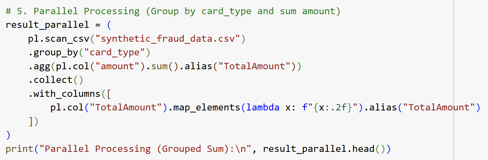

<h1>SECP3133 High Performance Data Processing - Section 02</h1>

<h2>Assignment 2 - Mastering Big Data Handling</h2>

<h3>Group DataStorm:</h3>
<ul>
<li><strong>NUR FARAH ADIBAH BINTI IDRIS</strong> - A22EC0245</li>
<li><strong>NUR ALEYSHA QURRATU'AINI BINTI MAT SALLEH</strong> - A22EC0241</li>
</ul>

<h2>Introduction</h2>
In the era of digital transformation, massive volumes of data are generated every second across various sectors, especially in financial systems where transaction records are essential. This project focuses on the analysis and processing of a large-scale synthetic fraud detection dataset. The dataset, which simulates real-world transactional data, requires efficient big data handling techniques to ensure optimal performance during exploration and analysis.
  

Given the scale and complexity of the dataset, traditional data processing methods may become inefficient or even infeasible. Therefore, modern Python-based libraries such as **Pandas**, **Dask**, and **Polars** are utilized in this project. These libraries offer robust functionalities for memory optimization, parallel processing, and efficient data handling. The aim is to apply a series of strategies to manage and process the dataset effectively while preserving the integrity and usability of the information.

<h2>Objectives</h2>
<ul>
<li>To apply multiple big data handling strategies including loading less data, chunking, sampling, type optimization, and parallel processing.</li>
<li>To compare performance of Pandas, Dask, and Polars in terms of memory usage and execution time.</li>
</ul>

<h2>Task 1: Dataset Selection</h2>
<h3>Dataset Description</h3>
The dataset selected for this assignment is a synthetically generated financial transactions dataset, designed to closely mimic real-world consumer behavior while maintaining data privacy. It was created using Python to support the development and evaluation of fraud detection models. The dataset includes a wide variety of transaction types across categories such as retail, groceries, dining, healthcare, entertainment, and travel, allowing for comprehensive analysis of legitimate and fraudulent activities.
 
 
Each transaction entry is accompanied by detailed attributes including:
- transaction amount
- timestamp
- merchant details
- card type
- customer device
- location
- an indicator specifying whether the transaction is fraudulent.

It also incorporates geographic diversity (e.g., multiple countries and currencies) and customer profile data (e.g., account age and device preference), which are critical for understanding transactional risk factors.

- **Source:** [Transactions – Synthetic Fraud Detection Data](https://www.kaggle.com/datasets/ismetsemedov/transactions)
- **File Size:** 2.93GB
- **Total Rows:** 7,483,766
- **Total Columns:** 24

Figure 1.0 shows the preview of the dataset from Kaggle.

    
    
<strong>Figure 1.0: Preview of synthetic_fraud_data.csv</strong>

  

<h2>Task 2: Load and Inspect Data</h2>
The selected dataset was loaded and initial inspection of the dataset was performed in order to understand its structure. This step served as a foundation of for applying big data handling techniques in later tasks.  
 
As shown in Figure 2.1, the process began by setting up the environment in Google Colab, where the Kaggle API was configured using the `kaggle.json` file to enable automated dataset downloading. After downloading and unzipping the dataset file (`synthetic_fraud_data.csv`), the Pandas library was used to load the entire dataset into memory.

    
    
<strong>Figure 2.1: Load Dataset Into Memory</strong>

  

Next, the fundamental metadata such as shape, column names, and data types was extracted to understand the data schema and distribution. Figure 2.2 illustrates the process of the data inspection. The `psutil` and `time` libraries were implemented to measure memory consumption and execution time before and after loading. Once loaded, the data was inspected to determine its dimension using `.shape`, list all column names using `.columns`, and identify data types of each column through `.dtypes`. The `.head()` function was used to preview the first few records. These steps provided an overview of the dataset, which consists of over 7 million rows and 24 features. This task was essential in understanding the scale of the data and set a performance baseline for evaluating the efficiency of future optimization techniques. 

    
    
<strong>Figure 2.2: Data Inspection</strong>

  

<h2>Task 3: Apply Big Data Handling Strategies</h2>

The objective of this task was to apply strategies to handle and process large datasets using Python. Given the substantial size of the dataset, traditional data loading and manipulation could lead to excessive memory consumption and long execution times. In order to address this issue, five big data strategies were implemented using three libraries, which are **Pandas**, **Dask**, and **Polars**. The strategies include, loading less data, chunking, optimizing data types, sampling, and parallel processing. These strategies helped reduce memory usage, improve performance, and prepare the dataset for future analysis. 

<h3>3.1 Pandas</h3>
<h4>3.1.1 Load Less Data</h4>

Figure 3.1.1 shows that only six essential columns (`transaction_id` , `customer_id`, `amount`, `country`, `city`, `card_type`) were selected during data loading using the usecols parameter in read_csv(). This reduced the amount of data read into memory and minimized unnecessary processing.

    
    
<strong>Figure 3.1.1: Load Less Data using Pandas</strong>

  

<h4>3.1.2 Chunking</h4>

As shown in Figure 3.1.2, the dataset was processed in chunks of 100,000 rows using `read_csv(chunksize=...)`. An operation was performed to count the number of transactions where the amount exceeded 100. This strategy allowed large datasets to be processed incrementally without overloading memory.

    
    
<strong>Figure 3.1.2: Chunking using Pandas</strong>

<h4>3.1.3 Optimize Data Types</h4>

Refer to Figure 3.1.3, in order to reduce memory usage, categorical columns like customer_id, country, city, and card_type were converted to the `category` data type, and the amount column was cast to `float32`. These conversions reduced the dataset’s overall memory footprint.

    
    
<strong>Figure 3.1.3: Optimize Data Types using Pandas</strong>

<h4>3.1.4 Sampling</h4>

Figure 3.1.4 demostrate that a random sample of 10,000 rows was selected using `.sample(n=10000)`. This enabled quicker testing and prototyping on a manageable subset of the full dataset.

    
    
<strong>Figure 3.1.4: Sampling using Pandas</strong>

<h4>3.1.5 Parallel Processing (Aggregation)</h4>

As shown in Figure 3.1.5, Group-by aggregation was performed using `groupby("card_type")["amount"].sum()` to compute the total transaction amount per card type. Although Pandas is single-threaded, it handled the operation effectively on the optimized dataset. The result was rounded and formatted to display two decimal places.

    
    
<strong>Figure 3.1.5: Parallel Processing (Aggregation) using Pandas</strong>

<h4>3.1.6 Output</h4>

Figure 3.1.6 displays the the performance metrics for Pandas. The total execution time was 65.20 seconds, and the memory used during processing was around 1175.30MB. This reflects Pandas' limitatin when dealing with large datasets, as it loads data eagerly into memory and operates in a single-threaded manner. 

    
    
<strong>Figure 3.1.6: Performance Metrics for Big Data Handling Process using Pandas</strong>

<h3>3.2 Dask</h3>
<h4>3.2.1 Load Less Data</h4>

As shown in Figure 3.2.1, the same set of columns was selected using the `usecols` parameter in `dd.read_csv()`. In Dask, data is not immediately loaded into memory until the operation is performed since Dask use lazy loading.

    
    
<strong>Figure 3.2.1: Load Less Data using Dask</strong>

  

<h4>3.2.2 Chunking</h4>

Figure 3.2.2 shows that in Dask, chunking(Lazy evaluation) is automatically and no need to do manual chunking like in Pandas. Dask automatically divides the CSV file into partitions.

    
    
<strong>Figure 3.2.2: Chunking using Dask</strong>

<h4>3.2.3 Optimize Data Types</h4>

Refer to Figure 3.2.3, Dask use `.astype()` to convert memory-heavy data types to `category` and reduce float precision to `float32`. This will optimise memory usage and execution time.

    
    
<strong>Figure 3.2.3: Optimize Data Types using Dask</strong>

<h4>3.2.4 Sampling</h4>

Figure 3.2.4 demonstrates that the `.sample(frac=0.1)` method was used to perform the same operation, extracting a random sample while maintaining performance. The sample fraction is processed lazily and in parallel.

    
    
<strong>Figure 3.2.4: Sampling using Dask</strong>

<h4>3.2.5 Parallel Processing (Aggregation)</h4>

Figure 3.2.5 shows that Dask performed the same aggregation using `df.groupby("card_type")["amount"].sum().compute().reset_index()` across multiple partitions, then merges the result with `.compute()` .

    
    
<strong>Figure 3.2.5: Parallel Processing (Aggregation) using Dask</strong>

<h4>3.2.6 Output</h4>

Figure 3.2.6 shows a better performance by using Dask. The total execution time and memory usage were lower than Pandas. This is due to Dask's ability to process data in Parallel and chunks.

    
    
<strong>Figure 3.2.6: Performance Metrics for Big Data Handling Process using Dask</strong>

<h3>3.3 Polars</h3>
<h4>3.3.1 Load Less Data</h4>

As shown in Figure 3.3.1, the same set of columns was selected using the `columns` parameter in `pl.read_csv()`. Polars benefits from being columnar and optimized for selecting specific fields, making this operation both fast and memory-efficient.

    
    
<strong>Figure 3.3.1: Load Less Data using Polars</strong>

  

<h4>3.3.2 Chunking</h4>

Figure 3.3.2 illustrates that instead of traditional chunking, Polars uses lazy evaluation with `scan_csv()`, allowing for deferred and optimized computation. A filter was applied to extract transactions with an amount greater than 100, and `.collect()` was used to execute the operation only when necessary.

    
    
<strong>Figure 3.3.2: Chunking using Polars</strong>

<h4>3.3.3 Optimize Data Types</h4>

Refer to Figure 3.3.3, a similar optimization was done using `.with_columns()` and applying `.cast()` to convert columns to efficient types such as `Categorical` and `Float32`. This step took advantage of Polar’s strong type system and internal compression.

    
    
<strong>Figure 3.3.3: Optimize Data Types using Polars</strong>

<h4>3.3.4 Sampling</h4>

Figure 3.1.4 demostrate that the `.sample(n=10000, with_replacement=False)` method was used to perform the same operation, extracting a random sample while maintaining performance.

    
    
<strong>Figure 3.3.4: Sampling using Polars</strong>

<h4>3.3.5 Parallel Processing (Aggregation)</h4>

Using lazy evaluation, Polars performed the same aggregation with `.group_by("card_type").agg(pl.col("amount").sum())` as shown in Figure 3.3.5. The results were collected and formatted using `.map_elements()` to ensure two decimal places. This approach was inherently faster due to Polars’ native multi-threading and memory efficiency.

    
    
<strong>Figure 3.3.5: Parallel Processing (Aggregation) using Polars</strong>

<h4>3.3.6 Output</h4>

Figure 3.3.6 demonstrates a better performance by using Polars. The total execution time was lower, and memory usage was reduced. This is due to Polars' use of lazy evaluation, multi-threaded execution, and an optimized columnar data format. As a result, Polars was able to process the same data more efficiently, making it a more suitable choice for large-scale data analysis in terms of speed and resource management.  

    
    
<strong>Figure 3.3.6: Performance Metrics for Big Data Handling Process using Polars</strong>

<h2>Task 4: Comparative Analysis</h2>
Figure 4.1 shows the performance comparison of data processing libraries 

    
    
<strong>Figure 4.1: Performance comparison of data processing between libraries</strong>

The table below presents a comparison based on execution time and memory usage:

<strong>Table 4.1: Performance comparison of data processing between libraries</strong>

| Library | Execution Time (Seconds) | Memory Used (MB) |
|---------|--------------------------|------------------|
| Pandas  | 65.20                    | 1175.30          |
| Dask    | 43.99                    | 95.46            |
| Polars  | 24.17                    | 16.23            |

Figure 4.1 and Table 4.1 show that Polars are better than Pandas and Dask in terms of execution time in seconds and memory usage in MB. Polars completes all tasks in just 24.17 seconds and uses only 16.23 MB of memory. making it the most memory-efficient and fastest among the three libraries. Dask performs significantly better than Pandas, with an execution time of 43.99 seconds and memory usage of 95.46 MB. On the other hand, Pandas present the slowest performance and highest memory usage with 65.20 seconds and 1175.30 MB.  

<h2>Task 5: Conclusion & Reflection</h2>
<h3>Conclusion</h3>
To conclude, Polars showed the best performance with the fastest execution time and the lowest memory usage. Meanwhile, Dask performs better than Pandas since it uses significantly less memory and executes faster. In terms of memory usage, Polars uses 72 times less memory than Pandas, and Dask uses about 12 times less memory than Pandas. Thus, Pandas was less efficient to use with this dataset as it is the slowest and consumes the most memory. 

Each of these libraries has its benefits and limitations. Table 5.1 shows the benefit and limitation of each library

<strong>Table 5.1: Benefit and limitation of each library</strong>

| Library | Benefits                              | Limitations                    |
|---------|---------------------------------------|--------------------------------|
| Pandas  |   Easy to use                         |  High memory usage             |
| Dask    |   Supports parallelism                |  Slightly more complex syntax  |
| Polars  |   Extremely fast and memory efficient |  Less mature ecosystem         |

<h3>Reflection</h3>
During this assignment, we learn how to retrieve a dataset from Kaggle using the API, which makes accessing data easier. Moreover, we explored several big data handling techniques such as chunking, loading less data, optimising data types, sampling and using parallel processing. These techniques helped us to handle massive datasets more effectively. Furthermore, we also compare the performance of Pandas, Dask and Polars to investigate their benefits and limitations. From this assignment, we found that Polars shows the best speed and memory utilization, while Dask handled big data well with parallel processing. This assignment improved our practical skills in handling big data and is useful for our future career in fields related to data handling. 

