<h1>SECP3133 High Performance Data Processing - Section 02</h1>

<h2>Assignment 2 - Mastering Big Data Handling</h2>

<h3>Group Datify:</h3>

<table>
  <thead>
    <tr>
      <th>Name</th>
      <th>Matrics Number</th>
    </tr>
  </thead>
  <tbody>
    <tr>
      <td><strong>CAMILY TANG JIA LEI</strong></td>
      <td>A22EC0039</td>
    </tr>
    <tr>
      <td><strong>NG SHU YU</strong></td>
      <td>A22EC0228</td>
    </tr>
  </tbody>
</table>

<h2>1.0 Introduction</h2>

  TThe amount of data created today is accelerating. This poses challenges for classical data processing tools. For instance, libraries such as Pandas may run into issues when working with datasets in the range of several hundred megabytes. These tools can reach memory limits and experience long processing times. Consequently, businesses require more scalable and efficient methods to process and analyse the growing volume of data more effectively.

<h2>1.1 Objectives</h2>

  The objectives of this assignment are to address the challenges of large-scale data extraction and processing by:

<ul>
  <li>To apply various big data techniques, including chunking, sampling, type optimisation, and parallel computing.</li>
  <li>To evaluate and compare the performance of traditional Pandas methods against optimised data handling strategies, such as Polars and Dask.</li>
  <li>To assess the effectiveness of each technique in terms of memory usage, execution time, and ease of processing.</li>
</ul>

<h2>2.0 Dataset Selection</h2>

  The dataset selected is the “500K+ Spotify Songs with Lyrics, Emotions & More” dataset, which is publicly available on Kaggle (Devdope, n.d.). This dataset contains information on over 500,000 Spotify songs, including audio features, metadata, and popularity metrics. For the purpose of this analysis, the CSV version of the dataset was utilised, comprising 551,440 entries.

<ul>
  <li><strong>Source:</strong> <a href="https://www.kaggle.com/datasets/devdope/900k-spotify/data">Kaggle</a></li>
  <li><strong>File Format:</strong> CSV</li>
  <li><strong>File Size:</strong> Approximately 1,122 MB (uncompressed)</li>
  <li><strong>Domain:</strong> Music Streaming and Audio Analysis</li>
  <li><strong>Total Records:</strong> 551,440 entries</li>
  <li><strong>Key Features:</strong> Song title, artist, genre, release date, popularity, and audio features such as tempo, energy, acousticness, and danceability.</li>
</ul>

  The size and variety of the dataset used to test big data handling methods are considered impressive. Both categorical and continuous data are included, allowing for the application of different optimisation approaches. Moreover, challenges commonly faced by organisations in the music streaming sector are presented in the dataset, effectively mirroring real-world conditions.

<h2>3.0 Load and Inspect Data</h2>

  The selected dataset was loaded and processed using three libraries—Pandas, Polars, and Dask—to demonstrate their performance. The objective was to efficiently read and process a large file while preserving the validity of the data and enabling further analysis, as illustrated in Table 1.

  <table border="1" cellpadding="8" cellspacing="0" style="border-collapse: collapse; width: 100%;">
    

      Table 1: Summary of Dataset Handling and Evaluation Procedures Across Libraries
    

    <tbody>
      <tr>
        <th style="text-align: left; width: 20%;">Environment Setup</th>
        <td>The Kaggle API key was uploaded and configured in Google Colab to download and extract the dataset for all methods.</td>
      </tr>
      <tr>
        <th style="text-align: left;">Data Loading</th>
        <td>Each library loaded the same subset of relevant columns: artist, song, length, emotion, genre, release date, popularity, energy, danceability, and positiveness. Data types were optimised by converting strings to categorical types and numerical features to 32-bit floats to reduce memory usage.</td>
      </tr>
      <tr>
        <th style="text-align: left;">Data Processing</th>
        <td>Missing values were removed, and a 10% random sample was taken to ensure fair comparison across libraries.</td>
      </tr>
      <tr>
        <th style="text-align: left;">Performance Measurement</th>
        <td>Execution time for loading, cleaning, and sampling was recorded. Memory usage of the sampled dataset was also calculated to evaluate efficiency.</td>
      </tr>
      <tr>
        <th style="text-align: left;">Inspection</th>
        <td>Each sampled dataset was inspected by displaying basic info such as column names, data types, number of entries, execution time, memory usage, and a preview of the first few rows.</td>
      </tr>
    </tbody>
  </table>

<h2>4.0 Big Data Handling Strategies</h2>

  Efficient handling of large datasets is regarded as a critical aspect of working with data at scale. Traditional data processing methods are often constrained by memory limitations, reduced speed, and limited scalability. To overcome these challenges, various techniques have been developed to optimise memory usage, enhance processing speed, and enable parallel execution of tasks. In this section, several useful strategies—such as loading specific columns, optimising data types, and reading files efficiently—are discussed. These techniques are examined in the context of the capabilities provided by Pandas, Dask, and Polars to highlight how each library addresses big data challenges in resource- and performance-sensitive scenarios.

<h3>4.1 Environment Setup and Dataset Acquisition</h3>

  A uniform environment setup was employed across the three data processing libraries—Pandas, Polars, and Dask—to ensure real, comparable, and controlled performance experiments. All experiments were conducted using Google Colab, a platform well-suited for working with large datasets under limited resources, and offering support for live collaboration.

  As shown in Figures 1, 2, and 3, the respective libraries were imported and initiated with standard preprocessing procedures. The uniform setup began with the upload of the Kaggle API access key (kaggle.json) and its definition in the system environment, which enabled secure access to the dataset. The dataset, titled “500K+ Spotify Songs with Lyrics, Emotions & More”, was accessed via the Kaggle API and extracted using Python’s ‘zipfile module’. Once extracted, the dataset was prepared for loading and processing within each of the libraries.

  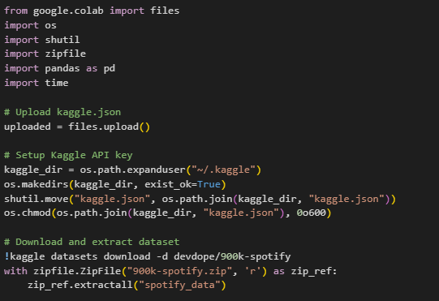
  
Figure 1: Pandas Environment Setup and Data Processing Workflow

  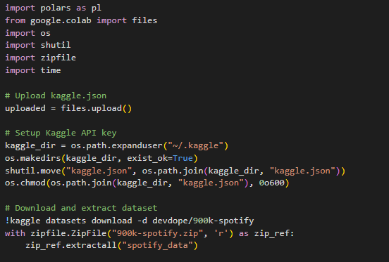
  
Figure 2: Polars Environment Setup and Data Processing Workflow

  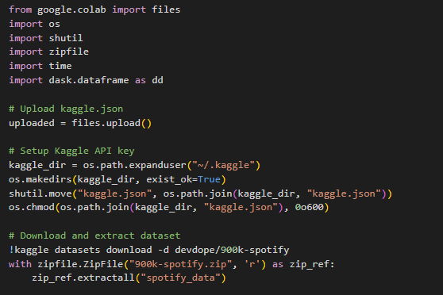
  
Figure 3: Dask Environment Setup and Data Processing Workflow

  To facilitate performance analysis, execution time was monitored using the ‘time’ module by marking the beginning and end of the execution interval. This process is illustrated in Figure 4, where the script initiates time tracking.

  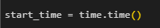
  
Figure 4: Start of Execution Time Tracking in All Libraries

  Moreover, each library provided its own method for determining execution time and memory usage, as shown in Figures 5, 6, and 7 for Pandas, Polars, and Dask, respectively. The total execution time was calculated by subtracting the start time from the end time, while memory consumption was obtained using library-specific functions. 

  For Pandas, memory usage was calculated using .memory_usage(deep=True).sum(). In Polars, the .estimated_size() method was applied. For Dask, .memory_usage(deep=True) was used, followed by aggregation of the results. 

  These measurements allowed for a reasonably fair comparison of memory usage and execution time across the three libraries during the dataset processing.

  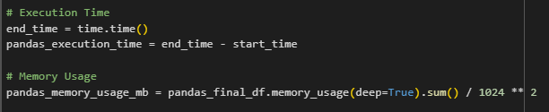
  
Figure 5: Execution Time and Memory Usage Calculation in Pandas

  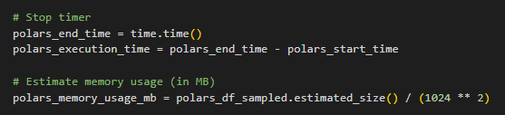
  
Figure 6: Execution Time and Memory Usage Calculation in Polars

  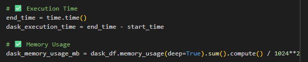
  
Figure 7: Execution Time and Memory Usage Calculation in Dask

<h3>4.2	Pandas</h3>

  Pandas is a widely used Python library for data manipulation, analysis, and cleaning (Johari, 2018). While Pandas is capable of handling large datasets, its performance is constrained by the available system RAM. This limitation arises because Pandas loads the entire dataset into memory; therefore, if the dataset exceeds the available memory, it cannot be processed and execution is terminated.

<h4>4.2.1	Column Filtering</h4>

  As shown in Figure 8, ten essential columns were selected using the ‘usecols’ parameter. By loading only the required columns, memory usage was reduced and the dataset was efficiently prepared for analysis. The selected columns included: "Artist(s)", "song", "Length", "emotion", "Genre", "Release Date", "Popularity", "Energy", "Danceability", and "Positiveness".

  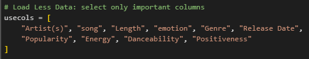
  
Figure 8: Column Filtering Using Pandas

<h4>4.2.2	Optimise Data Types</h4>

  To further reduce memory consumption, data types were optimised using a predefined dictionary ‘dtype_map’, as shown in Figure 9. String-based columns were converted to ‘category’ type, while numerical columns were stored as ‘float32’, which is more memory-efficient than the default ‘float64’.

  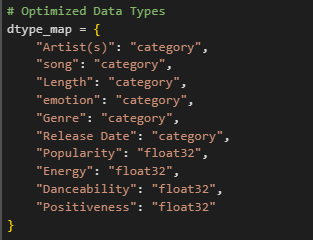
  
Figure 9: Data Type Optimisation Using Pandas

<h4>4.2.3	Chunking and Data Cleaning, and Sampling</h4>

  Figure 10 illustrates how chunking, data cleaning, and sampling were applied simultaneously. The dataset was read in chunks of 5,000 rows using the chunksize parameter in pd.read_csv() to avoid memory issues. Within each chunk, missing values were removed using .dropna(). Then, a 10% random sample was extracted using the .sample(frac=0.1, random_state=42) method. The random_state=42 ensures reproducibility by returning the same random selection each time the code is executed—an essential practice for consistency in experiments. This reduced the data volume while preserving representativeness. The sampled subsets were stored and later combined into a final dataset.

  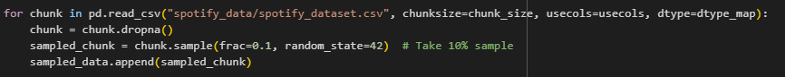
  
Figure 10: Chunking, Cleaning, and Sampling with Pandas

<h4>4.2.4	Combining Sampling Data</h4>

  As depicted in Figure 11, the list of sampled chunks was concatenated using pd.concat() to create the final DataFrame. This resulting dataset was optimised for further processing and performance testing, offering a balance between accuracy and efficiency.

  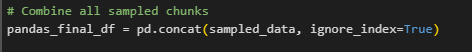
  
Figure 11: Combining Sampled Chunks in Pandas

<h4>4.2.5	 Output</h4>

  Figure 12 shows the output of loading and inspecting the sampled Spotify dataset using Pandas. The DataFrame contains 55,144 records and 10 columns, including artist names, song titles, length, emotion, genre, release date, and several audio features such as popularity, energy, danceability, and positiveness. The data types are a mix of ‘strings’ (object) for categorical fields and ‘float32’ for numeric features, resulting in a memory usage of approximately 22.42 MB. The figure also highlights the execution time for loading and processing the data, which is about 16.49 seconds. The preview of the data in the figure illustrates the typical structure and content, showing detailed values in each column.

  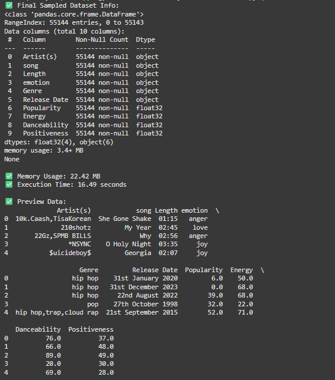
  
Figure 12: Output of Pandas Library

<h3>4.3	Polars</h3>

  Polars is a high-performance DataFrame library written in Rust, enabling extremely fast data manipulation and thus representing a highly appealing alternative to Pandas. One of its key features is automatic multithreading, whereby parallel operations are executed transparently across multiple cores without requiring any user configuration. This parallel query engine optimises performance, especially on large datasets, significantly reducing execution time compared to Pandas (Fisher, 2024).

<h4>4.3.1	Column Filtering</h4>

  Figure 13 demonstrates the Load Less Data strategy, where only ten relevant columns were selected using the ‘columns’ parameter in pl.read_csv(). This selective loading reduces memory usage and speeds up the initial data import process, which is especially beneficial when working in constrained environments like Google Colab. Additionally, Polars automatically leverages multithreading during the CSV parsing process, further improving efficiency by parallelising the workload across multiple CPU cores.

  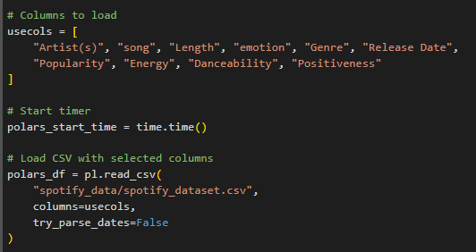
  
Figure 13: Column Filtering Using Polars

<h4>4.3.2	Optimise Data Types</h4>

  Following this, Figure 14 shows how the optimise data types strategy was implemented in Polars. Columns containing string or categorical data—such as "Artist(s)", "song", "Length", "emotion", "Genre", and "Release Date"—were cast to the ‘category’ type, which is efficient for repeated string values. Similarly, numerical columns like "Popularity", "Energy", "Danceability", and "Positiveness" were converted from default floating-point precision to ‘float32’, reducing memory usage without losing significant numerical detail. These operations are also automatically parallelised by Polars’ multithreaded engine, which contributes to reduced processing time.

  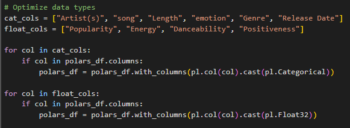
  
Figure 14: Data Type Optimisation Using Polars

<h4>4.3.3	File Loading</h4>

  Figure 15 shows the column-wise file loading using Polars. Only the required columns are loaded using the ‘columns’ parameter. This reduces memory usage and improves efficiency by avoiding unnecessary data. 

  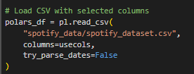
  
Figure 15: File Loading using Polars

<h4>4.3.4	Data Cleaning and Sampling</h4>

  Figure 16 illustrates how missing values were handled using the .drop_nulls() method. At this stage, a clean dataset was obtained, making it ready for sampling. Subsequently, 10% of the cleaned dataset was sampled using .sample(fraction=0.1, seed=42). The use of seed=42 ensured that the sampling process produced consistent results across multiple runs, which is essential for reproducibility and fair performance comparisons. Both the data cleaning and sampling processes benefitted from Polars' built-in automatic multithreading, which enabled parallel data processing and resulted in significantly faster execution times.

  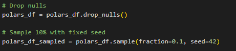
  
Figure 16: Cleaning and Sampling with Polars

<h4>4.3.5	Output</h4>

  Figure 17 displays the corresponding output when the same Spotify dataset is loaded using Polars. This figure demonstrates Polars’ more efficient handling of categorical data by using optimised categorical types, leading to a reduced memory footprint of only 10 MB. The schema presented in the figure explicitly shows categorical columns with physical ordering, which enhances performance. Furthermore, the execution time for loading and processing the data is recorded at 1.57 seconds. The data preview in Figure 17 shows a compact, well-structured view of the dataset, reflecting polars’ performance-orientated design.

  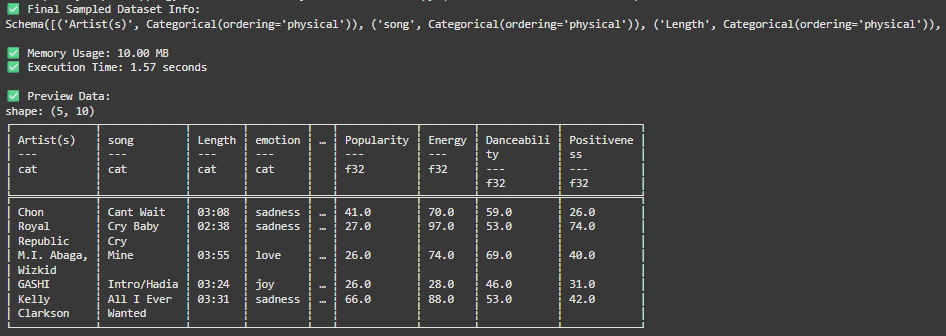
  
Figure 17: Output of Polars Library

<h3>4.4	Dask</h3>

  Dask, a scalable parallel computing Python library is used to operate on large datasets in an efficient manner (Edwin, 2025). Dask is a library specifically for big data and provides the same interface as Pandas but with parallelism and out-of-core computation (Wijaya, 2025).

<h4>4.4.1	Column Filtering</h4>

  Figure 18 illustrates the memory optimisation achieved through column filtering. To reduce memory usage and improve processing efficiency, only the necessary columns are loaded by specifying them with the ‘usecols’ parameter.

  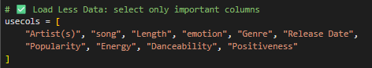
  
Figure 18: Column Filtering Using Dask

<h4>4.4.2	Optimise Data Types</h4>

  Figure 19 demonstrates memory optimisation through data type conversion. String-based columns are converted to the ‘category’ type, while numerical columns use ‘float32’ instead of the default ‘float64’. These optimisations help reduce memory consumption when working with large datasets.

  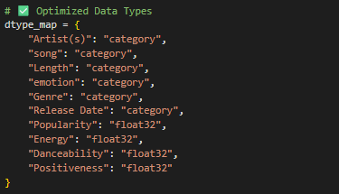
  
Figure 19: Data Type Optimisation Using Dask

<h4>4.4.3	File Loading</h4>

  Figure 20 shows the parallel file loading and lazy evaluation. The dataset was read using dd.read_csv(), which is different from how Pandas works. Dask reads the file in smaller chunks and processes them in parallel. This makes it possible to work with larger files without running into memory issues. Dask also does not run everything immediately; it waits until the result is needed, which helps speed up the process and avoid wasting memory.

  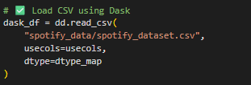
  
Figure 20: Parallel File Loading and Lazy Evaluation using Dask

<h4>4.4.4	Data Cleaning and Sampling</h4>

  Figure 21 shows the data cleaning and sampling without fully loading into memory. The dropna() function was used to remove rows with missing values, and a 10% sample of the data was taken using sample(). Both of these steps were done in parallel across the chunks of data, which makes them faster and more efficient, especially when dealing with big datasets.

  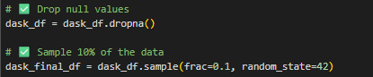
  
Figure 21: Cleaning and Sampling with Dask

<h4>4.3.5	Output</h4>

  Figure 22 shows the output and how the dataset was successfully loaded and processed using the Dask library. The info section lists the number of entries of columns and the data types. The memory usage tells how much space the dataset takes, and the execution time shows how long the whole process took. The first few rows of data are also displayed, giving a quick view that everything looks in order.

  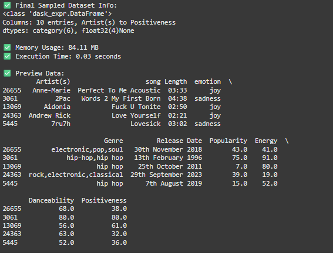
  
Figure 22: Output of Dask Library

<h2>5.0	Comparative Analysis</h2>

  In this comparative analysis, three data processing libraries—Pandas, Polars and Dask—are compared based on the time taken for execution, memory, and the ease of processing. Figure 23 shows the comparison of execution time and memory usage in bar charts.

  In terms of execution time, Dask far outshone Pandas and Polars in that aspect. Dask completed the task in just 0.03 seconds, a testament to the power of its lazy and parallelised computation. Polars also performed well with an execution time of 1.57 seconds due to the capability of its Rust-based design. Pandas took 16.49 seconds and was the slowest among the three.

  In regard to memory usage, Pandas used 22.42MB, Polars much less at 10MB, and Dask the most at 84.11MB. This is due to the fact that Dask has the distributed task overhead, which compromises memory for speed and scalability. Polars, which use the columnar memory model, use the most efficient memory usage.

  By ease of processing, Pandas is the most straightforward to use, most appropriate for small and medium-sized datasets due to its easy syntax and rich ecosystem. Polars is slightly less familiar to beginners but nevertheless finds a good balance between speed and simplicity. Dask brings complications with its delayed computation, which may require a learning curve, but it can be powerful at handling large-scale data.

  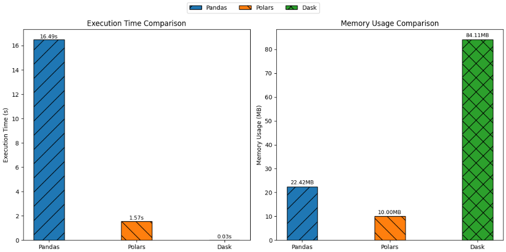
  
Figure 23: Comparison of Execution Time and Memory Usage between Libraries

<h2>6.0	Conclusion and Reflection</h2>

  Two important observations were made regarding the execution time and resource usage of three data processing libraries (Pandas, Polars, and Dask). Vastly different execution times and memory usages were recorded, reflecting fundamentally different approaches to processing. First, Pandas, a heavyweight, widely used, and popular library, recorded the highest processing time among the three (16.49 seconds) and moderate memory consumption (22.42 MB). It is designed to operate in memory using a single-threaded approach. Polars, which utilizes Rust-based multi-threading, demonstrated the best execution time (1.57 seconds) and consumed approximately half the memory of Pandas (10.00 MB). Dask outperformed both libraries in execution time by completing the task in 0.03 seconds. Designed with a scalable parallel architecture and lazy execution, Dask minimised the risk of high memory usage from loading all data at once. However, it did record the highest memory consumption at 84.11 MB.

  Each method possesses distinct advantages and disadvantages. Although Pandas offers extensive features and enjoys the highest level of user acceptance, it is primarily suitable for small to medium-sized datasets and exploratory data analysis due to its heavy memory usage, which limits scalability in terms of computing efficiency and speed. Even when sufficient memory is available, its performance is relatively slower compared to other options when handling large datasets. Polars enables fast, multithreaded data processing and requires less memory, making it well-suited for larger datasets, provided that adequate hardware is available. Dask is most effective when working with extremely large datasets that exceed RAM capacity and is particularly suitable for parallel and lazy computation. However, Dask also introduces significant complexity to programming, and its debugging process can be notably challenging.

  This study emphasises the importance of selecting appropriate data processing tools and optimisation strategies tailored to dataset size and resource availability. It was demonstrated that traditional single-threaded approaches may be insufficient for big data applications without techniques such as chunking or sampling. While modern parallelised libraries are capable of delivering considerable performance gains, their effective use requires a deeper technical understanding and careful attention to detail. Ultimately, the empirical findings presented offer valuable insights into the trade-offs among usability, scalability, and efficiency in data processing—factors that are essential for timely and effective analysis in real-world data science applications.

<h2>7.0 References</h2>
<ul>
  <li>Devdope. (n.d.). <em>500K+ Spotify songs with lyrics, emotions & more</em> [Data set]. Kaggle. <a href="https://www.kaggle.com/datasets/devdope/900k-spotify">https://www.kaggle.com/datasets/devdope/900k-spotify</a></li>
  <li>Edwin. (2025, February 27). <em>Dask: Detailed guide for scalable computing</em>. Python Central. <a href="https://www.pythoncentral.io/dask-detailed-guide-for-scalabale-computing/">https://www.pythoncentral.io/dask-detailed-guide-for-scalabale-computing/</a></li>
  <li>Fischer, B. (2024, December 23). <em>Python advanced: 10 things you can do with Polars (and didn’t know about it)</em>. Medium. <a href="https://captain-solaris.medium.com/python-advanced-10-things-you-can-do-with-polars-and-didnt-know-about-it-cb8c071227ba">https://captain-solaris.medium.com/python-advanced-10-things-you-can-do-with-polars-and-didnt-know-about-it-cb8c071227ba</a></li>
  <li>Johari, A. (2018, April 5). <em>Python Pandas guide - Learn Pandas for data analysis</em>. Medium. <a href="https://medium.com/edureka/python-pandas-tutorial-c5055c61d12e">https://medium.com/edureka/python-pandas-tutorial-c5055c61d12e</a></li>
  <li>Shahizan, D. (n.d.). <em>drshahizan</em> [GitHub repository]. GitHub. <a href="https://github.com/drshahizan/drshahizan">https://github.com/drshahizan/drshahizan</a></li>
  <li>Wijaya, C. Y. (2025, May 5). <em>Building end-to-end data pipelines with Dask</em>. KDnuggets. <a href="https://www.kdnuggets.com/building-end-to-end-data-pipelines-with-dask">https://www.kdnuggets.com/building-end-to-end-data-pipelines-with-dask</a></li>
</ul>