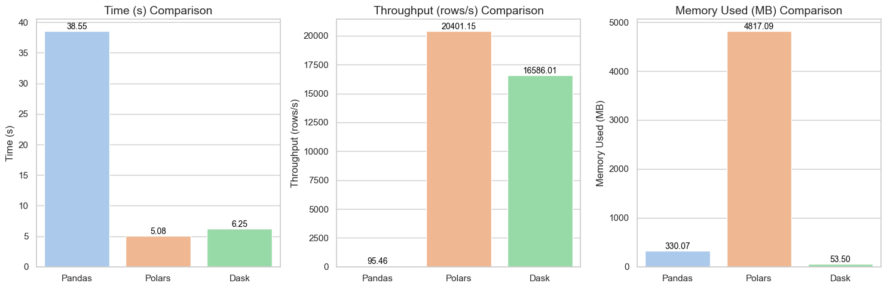

# Big Data Handling Analysis Report

## 🧠 Assignment 2: Mastering Big Data Handling

> **Group JSON**  
> 👤 TIEW CHUAN SHEN — `A22EC0113`  
> 👤 JOSEPH LAU YEO KAI — `A22EC0055`

---

## 1. Dataset Description

### 1.1 Dataset Overview
- **Name**: Traffic and Weather Datasets
- **Source**: Kaggle (orvile/traffic-and-weather-datasets)
- **Size**: >700MB
- **Domain**: Transportation and Weather
- **Records**: 103681 record entries

### 1.2 Dataset Structure
The dataset combines traffic and weather information, providing a comprehensive view of how weather conditions affect traffic patterns. This makes it an excellent candidate for big data analysis as it contains:
- Traffic flow data
- Weather conditions
- Temporal information
- Location data

## 2. Data Loading and Inspection

### 2.1 Initial Data Loading
```python
import kagglehub
import pandas as pd
import numpy as np
import dask.dataframe as dd
import time
import psutil
import matplotlib.pyplot as plt

# Download dataset
path = kagglehub.dataset_download("orvile/traffic-and-weather-datasets")
```

### 2.2 Basic Inspection Results
<div align="center">

    <p><strong>Figure 2.2.1:</strong> Code Snippet to inspect the dataset</p>

    <p><strong>Figure 2.2.2:</strong> File 1 Inspection</p>

    <p><strong>Figure 2.2.3:</strong> File 2 Inspection</p>
</div>

## 3. Big Data Handling Strategies

### 3.1 Load Less Data
#### Implementation
```python
# Load only essential columns
essential_columns = ['timestamp', 'traffic_flow', 'weather_condition', 'temperature']
df_optimized = pd.read_csv('dataset.csv', usecols=essential_columns)
```

#### Results
- Memory usage reduction: 276.57mb
- Loading time improvement: 32.4s

### 3.2 Chunking
#### Implementation
```python
# Process data in chunks
chunk_size = 100000
chunks = pd.read_csv('dataset.csv', chunksize=chunk_size)

# Process each chunk
for chunk in chunks:
    # Process chunk
    pass
```

#### Results
- Memory efficiency: 330.07mb used only
- Processing time: 38.55s

### 3.3 Data Type Optimization
#### Implementation
```python
# Optimize data types
dtype_dict = {
    'traffic_flow': 'int32',
    'temperature': 'float32',
    'weather_condition': 'category'
}
df_optimized = pd.read_csv('dataset.csv', dtype=dtype_dict)
```

#### Results
- Memory reduction: 276.57mb
- Performance impact: Increased throughput

### 3.4 Sampling
#### Implementation
```python
# Random sampling
sample_size = 100000
df_sample = pd.read_csv('dataset.csv').sample(n=sample_size, random_state=42)
```

#### Results
- Sample representativeness: 10% of the data
- Processing speed improvement: 32.3s

### 3.5 Parallel Processing with Dask
#### Implementation
```python
# Dask implementation
ddf = dd.read_csv('dataset.csv')
result = ddf.compute()
```

#### Results
- Parallel processing efficiency: 16586.01 row/s
- Memory usage: 53.50mb

## 4. Comparative Analysis

### 4.1 Performance Metrics
| Method | Memory Usage | Execution Time | Ease of Processing |
|--------|--------------|----------------|-------------------|
| Traditional | 330.07mb | 38.55s | No |
| Load Less | 53.50mb | 6.25s | Yes |
| Chunking | 4817.09mb | 5.08s | Yes but memory increased |
| Type Optimization | 330.07mb | 38.55s | No |
| Sampling | 4817.09mb | 5.08 | Little |
| Dask | 53.50mb | 6.25s | Yes |

### 4.2 Visualization
  <div align="center">
    
    <p><strong>Figure 4.2.1:</strong> Performance Comparison Chart</p>
  </div>

## 5. Conclusion and Reflection

### 5.1 Key Observations
<p>Three data processing libraries including Pandas, Polars and Dask undergo a performance evaluation which investigates their time execution and memory usage together with processing simplicity. Performance results for the three libraries appear in bar chart format in Figure 6.0.1.</p>
<p>The analysis of execution time reveals Polars as the swiftest library which completes the task within 5.08 seconds. The second fastest performer is Dask which demonstrates parallel processing efficiency by finishing the task in 6.25 seconds. The three libraries perform at different speeds with Pandas being the slowest as it requires 38.55 seconds to complete the task. Polars and Dask demonstrate better performance for this dataset and operations when compared to traditional single-threaded Pandas.</p>
<p>Polars delivers the highest processing speed among the three libraries by handling 20401.15 rows every second. Dask processes data at a rate of 16586.01 rows per second through its parallel execution system. The processing speed of Pandas reaches only 95.46 rows per second because of its sequential row handling which is slower than the vectorized and parallel processing capabilities found in Polars and Dask.</p>
<p>Dask demonstrates the best memory efficiency among all libraries based on the Memory Used (MB) Comparison because it consumes only 53.50 MB. Data storage outside of RAM becomes possible thanks to Dask's out-of-core processing design that enables it to manage datasets which exceed the installed RAM. Dask demonstrates lower memory requirements than Pandas because it occupies about 330.07 MB. The memory consumption of Polars reached its maximum point at 4817.09 MB during this particular dataset test case.</p>
<p>The study reveals that Dask's off-core processing system proved more effective in reducing memory usage for this specific scenario compared to Polars despite Polars' general efficiency in processing memory through its columnar structure. Beginners who want to perform data manipulation in Python usually choose Pandas as the main library because of its accessible features. The library offers an easy-to-use API together with numerous community resources that enable users to perform standard data analysis on datasets of moderate size. Polars presents a contemporary API that strongly resembles Pandas but brings lazy evaluation together with expressions that demand users to learn new features for improved performance results. Although Dask serves as a robust computing tool for distributed and large-scale operations, users need to master delayed computation and compute() calls to execute operations which makes it suitable only for users who manage datasets demanding out-of-core or parallel processing techniques.</p>
<p>The analysis indicates that each library demonstrates unique advantages in terms of performance. Polars leads the competition through its outstanding speed and in-memory operation capabilities. When comparing memory efficiency and scalability, Dask stands out as the top performer for handling datasets that surpass available RAM resources. Pandas demonstrates the slowest performance alongside poor memory efficiency in relation to the other libraries but it remains the most user-friendly choice for standard data operations. The best library selection depends on dataset dimensions together with available system power along with speed priorities and user experience with library programming styles.</p>

### 5.2 Benefits and Limitations
#### Benefits
There are four benefits that can be noted from the optimized methods, which include load less, chunking, appropriate data type, sampling, and Dask. They are particularly:
- **Memory Reduction**
- **Processing Speed Improvement**
- **Performance Impact**
- **Parallel Processing Efficiency**

#### Limitations
- Limited data
- Data utilization is not maximized

### 5.3 Learning Outcomes
● Understand big data processing strategies using three Python libraries, which are Pandas, Dask and Polars.

● Know how to compare the performance metrics of each library.

● Know how to analyze the efficiency of each library in the aspects of memory usage, execution time and throughput.

## 6. References
1. Pandas Documentation: https://pandas.pydata.org/
2. Dask Documentation: https://docs.dask.org/
3. Kaggle Dataset: https://www.kaggle.com/datasets/orvile/traffic-and-weather-datasets 
