<h1>SECP3133 High Performance Data Processing - Section 02</h1>

<h2>Assignment 2 - Mastering Big Data Handling</h2>

<h3>Group Shockwave:</h3>
<ul>
<li><strong>LIM JING YONG</strong> - A22EC0182</li>
<li><strong>LEE SOON DER</strong> - A22EC0065</li>
</ul>

<h2>Task 1: Dataset Selection</h2>

In this section, we decided to select our dataset in Kaggle due to its functionality to show the size of the dataset (in MB). This allows us to quickly find suitable and large enough dataset to undergo optimization during the dataset loading process.

The dataset we chose is the <strong>continental2.csv</strong> file from the <em>COVID-19 in the American Continent</em> dataset, which consists of <strong>1.07 GB</strong> of data. This dataset records the number of COVID-19 cases that happened across the years 2020 to 2022 in different countries.

  
  
<strong>Figure 1.1:</strong> View of the CSV file in Kaggle

The dataset consists of <strong>14 columns</strong> (2 irrelevant ID columns) and <strong>1,048,576 rows</strong> of data.

  
  
  
<strong>Figure 1.2:</strong> Data columns and row count from the CSV file

 

<h2>Task 2: Load and Inspect Data</h2>

In this section, the dataset was obtained using the Kaggle API and processed with Pandas in Google Colab. We also performed a basic inspection to understand the dataset's structure and contents.

  
  
<strong>Figure 2.1:</strong> Use of Kaggle API in Google Colab

Figure 2.2 below shows the installation of the Kaggle CLI tool and the command to download the desired dataset. This step automates the dataset retrieval process from the Kaggle website.

  
  
<strong>Figure 2.2:</strong> Installing Kaggle CLI and downloading dataset

Figure 2.3 below shows the code used to load the dataset (<code>continental2.csv</code>) into memory using the Pandas library. This method is commonly used for small to medium-sized datasets and is sufficient for initial inspection and cleaning.

  
  
<strong>Figure 2.3:</strong> Loading dataset using Pandas

After loading the dataset, we performed a basic inspection to understand its structure and contents, as shown in Figure 2.4 below.

  
  
<strong>Figure 2.4:</strong> Dataset inspection using Pandas

 

<h2>Task 3: Apply Big Data Handling Strategies</h2>

In this section, we showcase how the Dask and Polars libraries are used to optimize the performance of dataset loading.

<h3>Dask</h3>

Dask is a parallel computing library that scales the Pandas interface for large-memory data processing using lazy evaluation and task scheduling. In this section, we apply five optimization strategies using Dask to handle a large dataset efficiently. The complete implementation is shown in Figure 3.1 below.

  
  
<strong>Figure 3.1:</strong> Full implementation using Dask

  
  
<strong>Figure 3.1.1:</strong> Selecting relevant columns

  
  
<strong>Figure 3.1.2:</strong> Optimizing data types

  
  
<strong>Figure 3.1.3:</strong> Loading CSV in chunks with Dask

  
  
<strong>Figure 3.1.4:</strong> Sampling a portion of the dataset

  
  
<strong>Figure 3.1.5:</strong> Executing lazy operations with compute()

  
  
<strong>Figure 3.2:</strong> Output after executing all Dask operations

<h3>Polars</h3>

The <strong>Polars</strong> library is also used for optimization of dataset loading. Polars excels in handling datasets that are big but still fit into memory, making it a perfect choice for our scenario. Polars utilizes <em>lazy evaluation</em> and <em>multithreading</em>, which we will demonstrate in the figures below.

Figure 3.3 shows the full code used in our Polars library optimization technique:

<ul>  
<li><strong>Line 1</strong>: Polars library is imported.</li>
<li><strong>Line 4</strong>: Dataset is read lazily using the `lazy()` function.</li>
<li><strong>Lines 7 to 14</strong>: Polars methods are used to display dataset shape, columns, and data types.</li>
<li><strong>Lines 17 to end</strong>: Null and duplicated data are dropped, and the `collect()` function is used to trigger actual execution.
</ul>

  
  
<strong>Figure 3.3:</strong> Full coding of Polars optimization technique

Figure 3.4 shows the output after running the code. Output of column names were truncated due to string length exceeding browser width.

  
  
<strong>Figure 3.4:</strong> Output of the Polars optimization code

 

<h2>Task 4: Comparative Analysis</h2>

In this section, we evaluate the performance of each library and present the results of our qualitative performance measurements using graphs.

<h3>How We Compare</h3>

To assess performance, we use Python libraries such as <code>time</code>, <code>psutil</code>, and <code>os</code> to calculate:

<ul>
  <li>The <strong>time taken</strong></li>
  <li>The <strong>total memory used</strong></li>
</ul>

These measurements are taken at the <strong>start</strong> and <strong>end</strong> of the code execution that processes a large dataset. Each experiment is repeated <strong>three times</strong> to calculate the <strong>average</strong> processing time and memory usage for greater accuracy.

  
  
<strong>Figure 4.1:</strong> Code snippet for importing libraries and initializing performance tracking

  
  
<strong>Figure 4.2:</strong> Code snippet for capturing final measurements and calculating performance

<h3>Performance Results by Library</h3>

  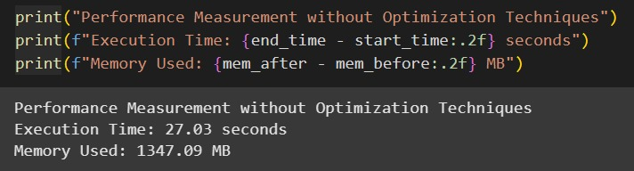
  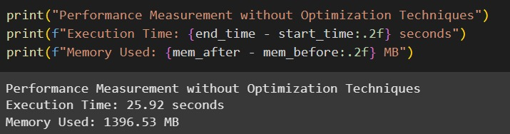
  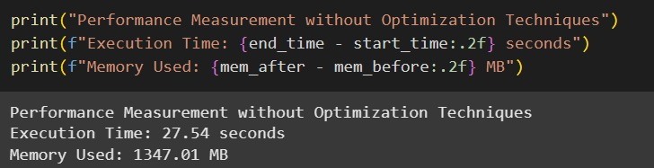
  
<strong>Figure 4.3:</strong> Three runs using Pandas library

  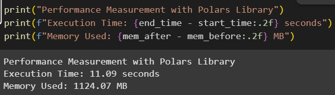
  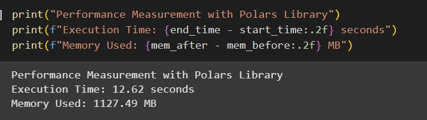
  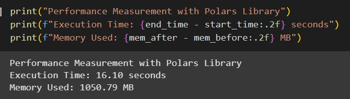
  
<strong>Figure 4.4:</strong> Three runs using Polars library

  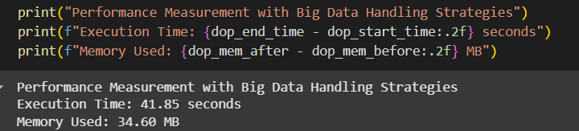
  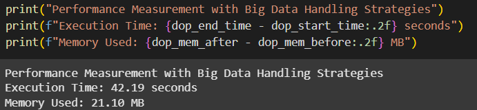
  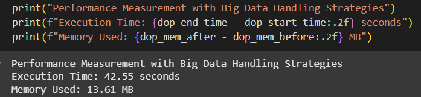
  
<strong>Figure 4.5:</strong> Three runs using Dask library

<h3>Execution Time Comparison</h3>

  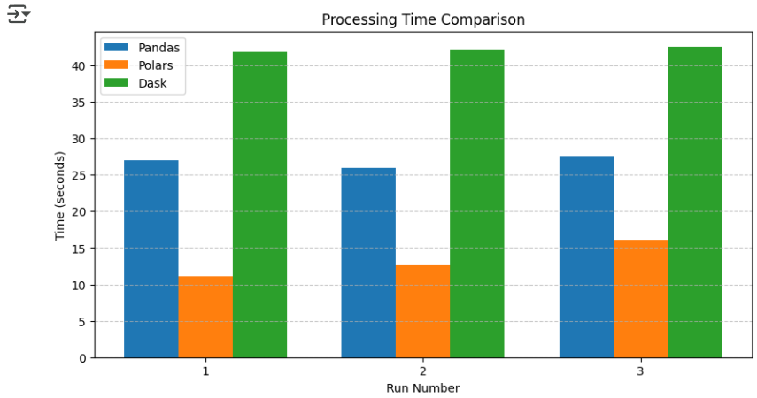
  
<strong>Figure 4.6:</strong> Execution time comparison of Pandas, Polars, and Dask

<h3>Memory Usage Comparison</h3>

  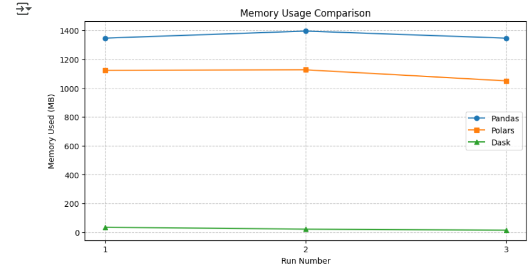
  
<strong>Figure 4.7:</strong> Memory usage comparison across Pandas, Polars, and Dask

<h3>Ease of Processing</h3>

  <table border="1" cellspacing="0" cellpadding="6">
    <tr>
      <th>Method</th>
      <th>Ease of Processing</th>
    </tr>
    <tr>
      <td>Pandas</td>
      <td>Easiest to use with familiar syntax but lacks optimization for large data.</td>
    </tr>
    <tr>
      <td>Polars</td>
      <td>Performed excellently with simple multithreading and is relatively easy to adopt.</td>
    </tr>
    <tr>
      <td>Dask</td>
      <td>Powerful scalability but requires more setup and understanding of parallel processing concepts.</td>
    </tr>
  </table>

 

## Task 5: Conclusion & Reflection

From this assignment, we are able to understand the significance of using optimization libraries such as Dask or Polars when working with big data. Several observations were made during the progression of the project.

Initially, Modin and Ray library were chosen as the tertiary library to perform optimization. However, the performance shows negative improvement, possibly due to the dataset not being big enough (even if it's 1GB). Memory used also increased significantly, due to Ray workers paralleling jobs and taking more space.

Next, simplicity of task or operation when using these optimization libraries also play a part in defining the performance of the libraries. For example, due to this assignment measuring only the process of loading the dataset and some simple data inspections, libraries such as Dask get an increase in processing time due to its parallel and distributed architecture. This means extra time is used to create a “Task graph” to allow Dask to perform parallelism, which exceeds the actual time taken to run the codes. However, memory usage significantly decreases as chunk processing (128 MB in our case) loads shards of the entire dataset into each worker, lowering peak memory usage overall.

Pandas library on the other hand performs averagely in terms of processing time and memory usage. As an eager execution library, processing time of loading the dataset was not significantly high due to simplicity of operation. However, memory usage across each run (Refer Task 4) appears the highest because the entire 1 GB dataset is loaded into memory on runtime through a single CPU and no parallelization.

Last but not least, Polars is the best library option for our exact scenario. Polars support datasets which are not overly large (> 10 GB) due to multithreading which utilizes CPU cores instead of spawning workers like Dask. This factor lowers memory usage. Lazy execution property of Polars also optimizes the coding pipeline which is user-defined, rather than creating a new system-defined “Task Graph” like Dask on runtime, ensuring the total processing time does not surpass the actual time used to process the operations.

With that being said, we can determine libraries efficiency can be ordered as:

**Polars > Dask > Pandas**

Where the dataset is not significantly large while processing operation is simple.
