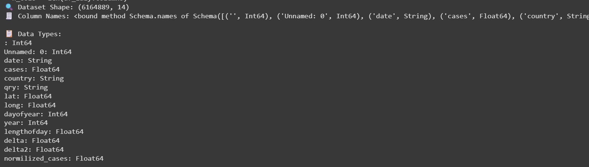

# SECP3133 High Performance Data Processing - Section 02

## Assignment 2 - Mastering Big Data Handling

### Group Shockwave:
- **LIM JING YONG** - A22EC0182  
- **LEE SOON DER** - A22EC0065

---

## Task 1: Dataset Selection

In this section, we decided to select our dataset in Kaggle due to its functionality to show the size of the dataset (in MB). This allows us to quickly find suitable and large enough dataset to undergo optimization during the dataset loading process.

The dataset we chose is the **continental2.csv** file from the _COVID-19 in the American Continent_ dataset, which consists of **1.07 GB** of data. This dataset records the number of COVID-19 cases that happened across the years 2020 to 2022 in different countries.

  
**Figure 1.1**: View of the CSV file in Kaggle

The dataset consists of **14 columns** (2 irrelevant ID columns) and **1,048,576 rows** of data.

  
  
**Figure 1.2**: Data columns and row count from the CSV file

 

## Task 2: Load and Inspect Data

In this section, the dataset was obtained using the Kaggle API and processed with Pandas in Google Colab. We also performed a basic inspection to understand the dataset's structure and contents.

Figure 2.1 below shows the use of the Kaggle API to automate dataset retrieval. This step is mandatory for enabling authenticated downloads in Colab.

  
**Figure 2.1:** Use of Kaggle API in Google Colab

Figure 2.2 below shows the installation of the Kaggle CLI tool and the command to download the desired dataset. This step automates the dataset retrieval process from the Kaggle website.

  
**Figure 2.2:** Installing Kaggle CLI and downloading dataset

Figure 2.3 below shows the code used to load the dataset (`continental2.csv`) into memory using the Pandas library. This method is commonly used for small to medium-sized datasets and is sufficient for initial inspection and cleaning.

  
**Figure 2.3:** Loading dataset using Pandas

After loading the dataset, we performed a basic inspection to understand its structure and contents, as shown in Figure 2.4 below.

  
**Figure 2.4:** Dataset inspection using Pandas

 

## Task 3: Apply Big Data Handling Strategies

In this section, we showcase how the Dask and Polars libraries are used to optimize the performance of dataset loading.

### Dask

Dask is a parallel computing library that scales the Pandas interface for large-memory data processing using lazy evaluation and task scheduling. In this section, we apply five optimization strategies using Dask to handle a large dataset efficiently. The complete implementation is shown in Figure 3.1 below.

  
**Figure 3.1:** Full implementation using Dask

Figure 3.1.1 shows line 11 of the implementation. Only relevant columns are selected to reduce load size, which reduces memory usage and speeds up loading by skipping irrelevant data.

  
**Figure 3.1.1:** Selecting relevant columns

Figure 3.1.2 shows line 14 of the implementation. Data types are optimized by converting numeric fields to float32 and categorical columns to category, reducing memory usage.

  
**Figure 3.1.2:** Optimizing data types

Figure 3.1.3 shows line 18 of the implementation. The CSV file is loaded in parallel using dd.read_csv() with blocksize="128MB" to split data into smaller partitions, also known as chunking.

  
**Figure 3.1.3:** Loading CSV in chunks with Dask

Figure 3.1.4 shows line 23 of the implementation. A 10% sample of the dataset is taken for faster prototyping.

  
**Figure 3.1.4:** Sampling a portion of the dataset

Figure 3.1.5 shows line 26 of the implementation. The compute() function is triggered to execute all lazy operations.

  
**Figure 3.1.5:** Executing lazy operations with compute()

Finally, Figure 3.2 shows the output after running the code. Dask successfully demonstrates how these strategies collectively reduce memory usage and prepare the data efficiently.

  
**Figure 3.2:** Output after executing all Dask operations

### Polars

Next, the **Polars** library is also used for optimization of dataset loading. Polars excels in handling datasets that are big but still fit into memory, making it a perfect choice for our scenario.

Polars utilizes **lazy evaluation** and **multithreading**, which we will demonstrate in the figures below.

Figure 3.3 shows the full code used in our Polars library optimization technique:  
- **Line 1**: Polars library is imported.  
- **Line 4**: Dataset is read lazily using the `lazy()` function.  
- **Lines 7 to 14**: Polars methods are used to display dataset shape, columns, and data types.  
- **Lines 17 to end**: Null and duplicated data are dropped, and the `collect()` function is used to trigger actual execution.

**Figure 3.3:** Full coding of Polars optimization technique

Figure 3.4 shows the output after running the code. Output of column names were truncated due to string length exceeding browser width.

**Figure 3.4:** Output of the Polars optimization code

 

## Task 4: Comparative Analysis

In this section, we evaluate the performance of each library and present the results of our qualitative performance measurements using graphs.

### How We Compare

To assess performance, we use Python libraries such as `time`, `psutil`, and `os` to calculate:
- The **time taken**
- The **total memory used**

These measurements are taken at the **start** and **end** of the code execution that processes a large dataset. Each experiment is repeated **three times** to calculate the **average** processing time and memory usage for greater accuracy.

### Code Snippets

The following figure shows the code used to import performance measurement libraries and initialize tracking variables:

  
**Figure 4.1:** Code snippet for importing libraries and initializing performance tracking

The next figure shows the code for recording final metrics and computing the actual time taken and memory consumed during the operation:

  
**Figure 4.2:** Code snippet for capturing final measurements and calculating performance

### Result

### Performance Results by Library

Figure 4.3 shows the results of the first, second, and third run using the Pandas library.

  
  
  
**Figure 4.3:** Three runs using Pandas library

Figure 4.4 shows the results of the first, second, and third run using the Polars library.

  
  
  
**Figure 4.4:** Three runs using Polars library

Figure 4.5 shows the results of the first, second, and third run using the Dask library.

  
  
  
**Figure 4.5:** Three runs using Dask library

---

### Execution Time Comparison

Figure 4.6 presents a bar chart showing the processing time (in seconds) taken by each method over three repeated runs. Pandas took around 27 seconds on average. Polars consistently outperformed the others by completing tasks in as little as 11–16 seconds. Dask, while designed for scalability, showed longer processing time (around 42 seconds) due to task scheduling and overhead in parallel execution.

  
**Figure 4.6:** Execution time comparison of Pandas, Polars, and Dask

---

### Memory Usage Comparison

Figure 4.7 presents a line chart showing the memory usage (in MB) for each approach across three runs. Pandas used the most memory (~1350MB), which may be problematic for large datasets. Polars significantly reduced memory usage to around 1100MB due to its efficient memory management in Rust. Dask showed the lowest memory usage because it loads data in chunks rather than all at once.

  
**Figure 4.7:** Memory usage comparison across Pandas, Polars, and Dask

