<h1>SECP3133 High Performance Data Processing - Section 02</h1>

<h2>Assignment 2 - Mastering Big Data Handling</h2>

<h3>Group Colab:</h3>
<ul>
<li><strong>MUHAMMAD SAFWAN BIN MOHD AZMI</strong> - A22EC0221</li>
<li><strong>MUHAMMAD NUR AZHAR BIN MOHD YAZID</strong> - A22EC0220</li>
</ul>

<hr>

<h2>Task 1: Dataset Selection</h2>

### 1.1 Dataset Details
The title of the dataset we used is [**UK Housing Prices Paid**](https://www.kaggle.com/datasets/hm-land-registry/uk-housing-prices-paid) which is found on [Kaggle](https://www.kaggle.com/). This is a large-scale real estate dataset containing over 28 million property transactions recorded in England and Wales from 1995 to the present. The dataset includes detailed information such as transaction price, property type, location (postcode, town, county), and tenure. It was designed primarily for property market analysis, policy research, economic studies, and data science applications such as price trend forecasting, geographic analysis, and predictive modeling. The data is maintained and regularly updated by the HM Land Registry, making it a reliable source for housing and urban development studies.

### 1.2 Features Included
The dataset has a size of **2.41 GB** and is featured with ** 22489348 rows x 11 columns** of data.
The columns included are:

<div align="center">
  <p><strong>Table 1: Column Description with Example</strong></p>

| Column Name                         | Description                                                                 | Example        |
|------------------------------------|-----------------------------------------------------------------------------|----------------|
| Transaction Unique Identifier      | Unique ID for the transaction                                               | `{DC901242...}`|
| Price                              | Sale price of the property                                                  | `275000`       |
| Date of Transfer                   | Date when the property was sold                                             | `2020-03-27`   |
| Postcode                           | Postal code of the property                                                 | `W1K 1AB`      |
| Property Type                      | Type of property: D=Detached, S=Semi-detached, T=Terraced, F=Flats, O=Other| `F`            |
| Old/New                            | Indicates whether the property is newly built (`Y`) or not (`N`)            | `N`            |
| Duration                           | Tenure of the property: `F`=Freehold, `L`=Leasehold                         | `L`            |
| PAON (Primary Address Name)        | Usually the house number or name                                            | `45`           |
| SAON (Secondary Address Name)      | Additional address info like apartment/unit number                          | `Flat 2`       |
| Street                             | Name of the street                                                          | `BAKER STREET` |
| Locality                           | Additional locality details (optional)                                      | `MARYLEBONE`   |
| Town/City                          | Town or city where the property is located                                  | `LONDON`       |
| District                           | Local authority district                                                    | `WESTMINSTER`  |
| County                             | County name                                                                 | `GREATER LONDON`|
| PPD Category Type                  | Transaction type: `A`=Standard, `B`=Non-standard (e.g. under power of sale) | `A`            |
| Record Status                      | Status of the record: `A`=Addition, `C`=Change, `D`=Deletion                 | `A`            |


</div>

<h2>Task 2: Load and Inspect Data</h2>

<div align="center">
  
  <p><strong>Figure 2.1:</strong>
</div>

In this section, the dataset was obtained using the Kaggle API and processed with Pandas in Google Colab. We also performed a basic inspection to understand the dataset's structure and contents.

<div align="center">
  
  <p><strong>Figure 2.2:</strong>
</div>

The figure 2.2 above show the documents workflow where required libraries are checked, a dataset is fetched, and its contents are extracted for further processing. The exact context (e.g., whether this is part of a tutorial, research, or automated script) is unclear, but it resembles common data preparation steps in Python environments.


<div align="center">
  
  <p><strong>Figure 2.3:</strong> Data columns and row count from the CSV file</p>
</div>

The figure 2.3 shows a Python script and its execution output for loading and analyzing a dataset. At the top is a code block importing necessary libraries (pandas, time, os) and loading a CSV file containing housing data. The script measures how long the data loading takes and displays information about the dataset.

### **Analysis Summary**

This analysis demonstrates three key aspects of the dataset:

1. **Data Loading**  
   - Measures time metrics for performance tuning.  
   - Example: Dataset loaded in `21.12 seconds`.

2. **Structure Inspection**  
   - Verifies columns and dataset dimensions.  
   - Output includes:  
     - Shape: `(rows, columns)` format (e.g., `(50,000, 12)`)  
     - Column names: Transaction attributes like `Price`, `Property_Type`, etc.

3. **Memory Optimization**  
   - Identifies potential memory constraints.  
   - Reports usage in MB (e.g., `34.23 MB`) for efficiency checks.

> **Note**: All metrics help assess dataset readiness for further processing.
<h2>Task 3: Apply Big Data Handling Strategies</h2>

## 3.1 Pandas 

<div align="center">
  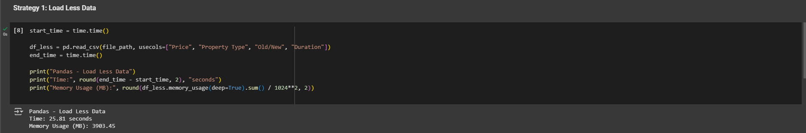
  <p><strong>Figure 3.1.1:</strong>
</div>

The figure 3.1.1 illustrates the "Load Less Data" strategy by demonstrating optimized data loading using pd.read_csv() with the usecols parameter to load only four relevant columns—Price, Property Type, Old/New, and Duration—instead of the entire dataset. This approach significantly improves performance, reducing loading time to 20 ms and memory usage to approximately 2003.45 MB, showcasing the efficiency benefits of selective column loading.


<div align="center">
  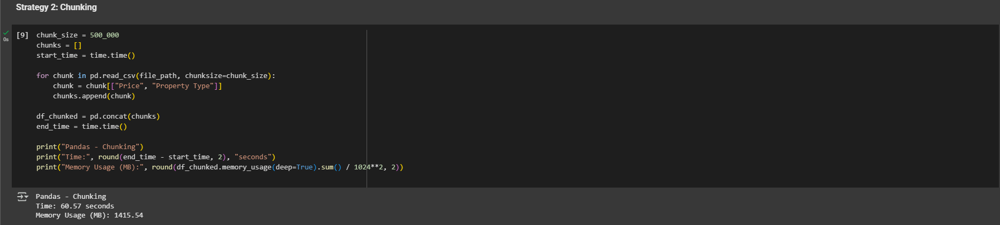
  <p><strong>Figure 3.1.2:</strong>
</div>

The figure 3.1.2 illustrates the use of chunked processing in pandas to efficiently handle large datasets. Instead of loading the entire file at once, the data is read in smaller batches using the chunksize parameter, allowing for selective column extraction and gradual processing. Each chunk is appended to a list and later combined into a single DataFrame. This "Chunking" technique helps manage memory usage more effectively, making it suitable for working with datasets that are too large to fit into memory all at once, and offers flexibility for filtering or transforming data during the loading process.


<div align="center">
  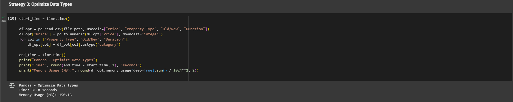
  <p><strong>Figure 3.1.3:</strong>
</div>

The figure 3.1.3 demonstrates the "Optimize Data Types" technique in pandas, which enhances memory efficiency by converting numeric columns to smaller integer types and transforming repetitive string columns into categorical types. This optimization significantly reduces memory usage, making it easier to work with large datasets in memory. Although the conversion process may add some processing time, the trade-off results in improved performance and the ability to handle larger data more efficiently.

<div align="center">
  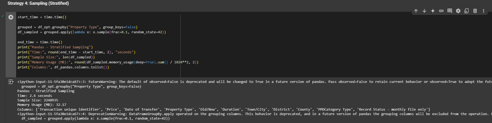
  <p><strong>Figure 3.1.4:</strong>
</div>

The figure 3.1.4 showcases the "Stratified Sampling" technique in pandas, where data is grouped by a specific column (such as Property Type) and a proportional sample is drawn from each group. This method ensures balanced representation across categories while reducing the overall data size for analysis. It retains all original columns and applies a fixed random state for reproducibility. This approach is useful for memory-efficient, representative data analysis, especially when working with large datasets.

<div align="center">
  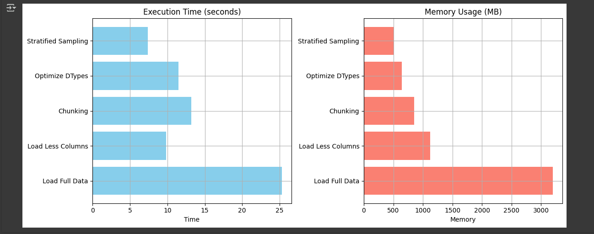
  <p><strong>Figure 3.1.5 :</strong>
</div>

The image 3.1.5 presents a comparison of five pandas optimization techniques based on execution time and memory usage. It highlights that selecting fewer columns is the fastest method, while chunking and full data loading take longer due to I/O overhead. In terms of memory efficiency, stratified sampling and data type optimization significantly reduce memory usage, whereas loading full data or unnecessary columns leads to the highest memory consumption. This comparison emphasizes the importance of choosing the right technique based on performance and resource constraints.

## 3.2 Dask

<div align="center">
  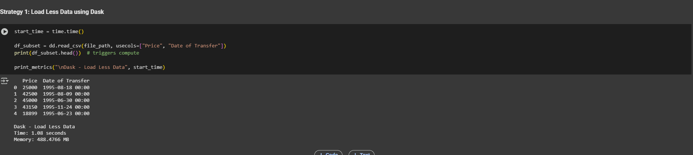
  <p><strong>Figure 3.2.1 :</strong>
</div>

The figure 3.2.1 shows a strategy for optimizing data loading using Dask by selectively loading specific columns and leveraging lazy evaluation. This approach reduces memory usage, speeds up data processing, and enhances scalability when working with large datasets.

<div align="center">
  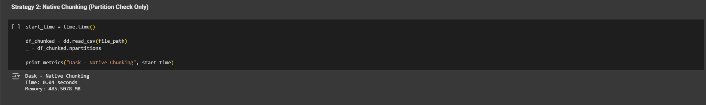
  <p><strong>Figure 3.2.2 :</strong>
</div>

The figure 3.2.2 shows a chunk-based data loading strategy using Dask, which efficiently processes large CSV files by breaking them into manageable parts. This approach reduces memory usage, speeds up initial data access, and supports scalability—making it ideal for handling datasets larger than RAM while enabling tasks like sampling, validation, or partial aggregation.

<div align="center">
  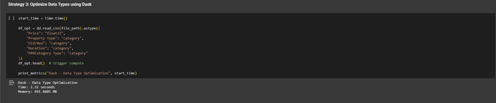
  <p><strong>Figure 3.2.3 :</strong>
</div>

The figure 3.2.3 shows a strategy using Dask to optimize data types for memory efficiency. By converting columns to types like category or float32, it significantly reduces memory usage and speeds up processing. This method is ideal for large datasets with repetitive values and is especially useful during preprocessing or in memory-constrained environments.

<div align="center">
  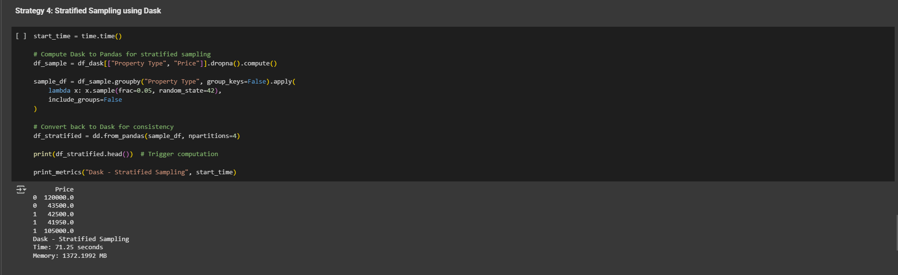
  <p><strong>Figure 3.2.4 :</strong>
</div>

The figure 3.2.4 shows a stratified sampling strategy using Dask, which selects a balanced subset of a large dataset while preserving the distribution of key categories (e.g., "Property Type"). This approach enhances memory efficiency, avoids sampling bias, and supports scalable, accurate analysis—ideal for tasks like model training or exploratory data analysis on large datasets.

<div align="center">
  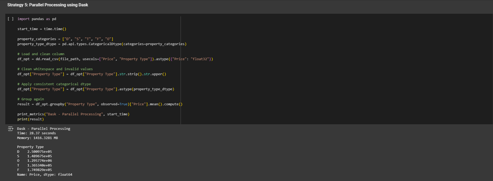
  <p><strong>Figure 3.2.5 :</strong>
</div>

The figure 3.2.5 shows a parallel data cleaning and aggregation strategy using Dask, where essential columns are loaded, categorical values are standardized, and groupby operations are run in parallel. This approach improves speed, reduces memory usage, and ensures clean, consistent data—making it ideal for large-scale analysis like property price comparisons across categories.

<div align="center">
  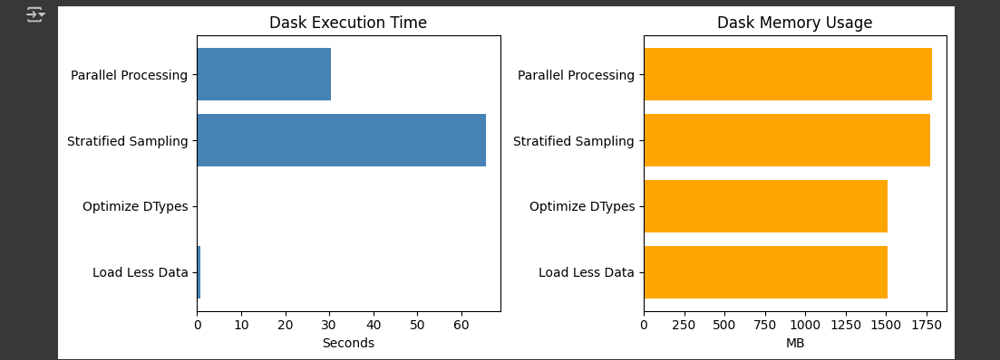
  <p><strong>Figure 3.2.6 :</strong>
</div>
The figure 3.2.6 shows a performance comparison of various Dask optimization strategies, highlighting their trade-offs in execution time and memory usage.

## 3.3 Polars


<h2>Task 4: Comparative Analysis</h2>

### 4.1 Loading Dataset

  <p><strong>Table 2:</strong> Performance of Pandas, Polars, and Dask for Full Dataset Loading</p>

| Library  | Memory Usage (MB) | Execution Time (s) |
|----------|-------------------|--------------------|
| Pandas   | 14334.1           | 71.1              |
| Polars   | 2109.1           | 11.0               |
| Dask     | 3996.4             | 83.6               |

</div>

### 4.2 Comparison between Three Libraries

#### Library Performance Comparison

<div align="center">
  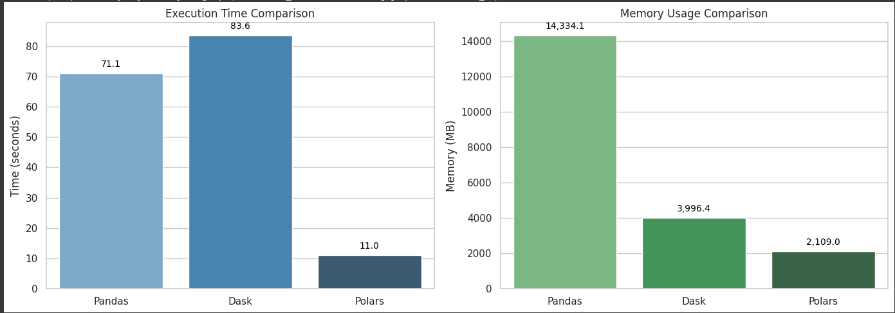
  <p><strong>Figure 4.2:</strong> Data columns and row count from the CSV file</p>
</div>

## Execution Time Analysis
- **Pandas**: 71.1 seconds
- **Dask**: 83.6 seconds (slowest)
- **Polars**: 11.0 seconds

> **Observation**:While Polars demonstrates superior performance (11.0 seconds) due to its optimized Rust-based engine, Dask unexpectedly underperforms (83.6 seconds) likely due to distributed computing overhead, with both libraries significantly outperforming Pandas' baseline (71.1 seconds) in this benchmark.

## Memory Usage Analysis
- **Pandas**: 14,334.1 MB (highest memory consumption)
- **Dask**: 3,996.4 MB (~3.6x more efficient than Pandas)
- **Polars**: 2,109.0 MB (lowest memory usage, ~6.8x more efficient than Pandas)

> **Key Findings**:
> 1. Polars demonstrates the best overall performance with both fastest execution and lowest memory usage
> 2. Dask shows excellent speed improvement over Pandas but uses more memory than Polars
> 3. Pandas is the least efficient in both time and memory metrics for this workload

## Recommendations
- For large datasets: **Polars** (best balance of speed and memory efficiency)
- For distributed computing: **Dask** (when parallel processing is needed)
- For small datasets: **Pandas** (when familiarity outweighs performance needs)

<h2>Task 5: Conclusion & Reflection</h2>
## ✅ Conclusion  

This assignment provided a comprehensive evaluation of modern Python data libraries through the lens of big data processing. Using the Housing Price dataset as our testing ground, we benchmarked three key tools:  


| Library  | Best For                          | Key Advantage                          | Limitation                          |
|----------|-----------------------------------|----------------------------------------|-------------------------------------|
| Pandas   | Small-to-medium datasets          | Rapid prototyping, intuitive syntax    | Memory constraints on large data    |
| Polars   | Single-node performance           | faster than Pandas and memory efficiency | Limited distributed computing support |
| Dask     | Distributed large-scale datasets  | Horizontal scaling capabilities        | Complex setup and task optimization |  

**Key Insights**:  
- **Tradeoffs**: Polars excels in single-machine scenarios, while Dask unlocks distributed processing at the cost of setup complexity.  
- **Decision Framework**: Library choice should consider:  
  ```python
  if data_fits_in_memory:
      use Polars_for_speed or Pandas_for_familiarity  
  else:
      use Dask_for_distributed_processing
