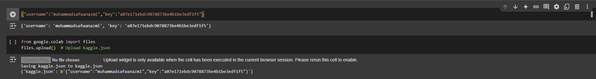
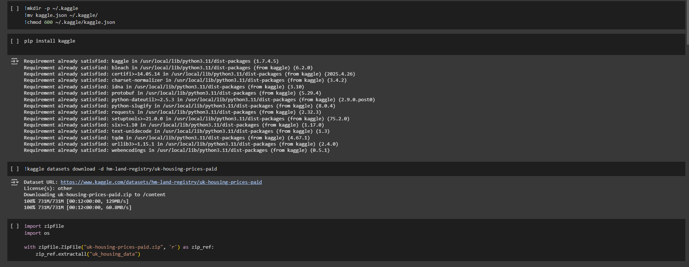
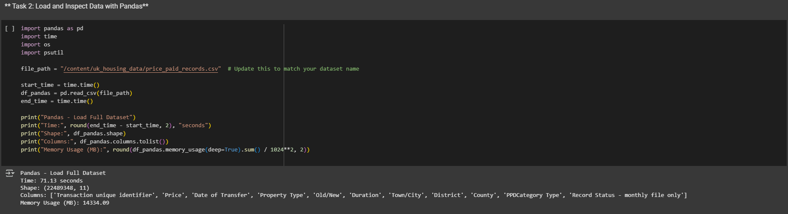

<h1>SECP3133 High Performance Data Processing - Section 02</h1>

<h2>Assignment 2 - Mastering Big Data Handling</h2>

<h3>Group Colab:</h3>
<ul>
<li><strong>MUHAMMAD SAFWAN BIN MOHD AZMI</strong> - A22EC0221</li>
<li><strong>MUHAMMAD NUR AZHAR BIN MOHD YAZID</strong> - A22EC0220</li>
</ul>

<h2>Task 1: Dataset Selection</h2>

### 1.1 Dataset Details
The title of the dataset we used is [**UK Housing Prices Paid**](https://www.kaggle.com/datasets/hm-land-registry/uk-housing-prices-paid) which is found on [Kaggle](https://www.kaggle.com/). This is a large-scale real estate dataset containing over 28 million property transactions recorded in England and Wales from 1995 to the present. The dataset includes detailed information such as transaction price, property type, location (postcode, town, county), and tenure. It was designed primarily for property market analysis, policy research, economic studies, and data science applications such as price trend forecasting, geographic analysis, and predictive modeling. The data is maintained and regularly updated by the HM Land Registry, making it a reliable source for housing and urban development studies.

### 1.2 Features Included
The dataset has a size of **2.41 GB** and is featured with ** 22489348 rows x 11 columns** of data.
The columns included are:

  
<strong>Table 1: Column Description with Example</strong>

| Column Name                         | Description                                                                 | Example        |
|------------------------------------|-----------------------------------------------------------------------------|----------------|
| Transaction Unique Identifier      | Unique ID for the transaction                                               | `{DC901242...}`|
| Price                              | Sale price of the property                                                  | `275000`       |
| Date of Transfer                   | Date when the property was sold                                             | `2020-03-27`   |
| Postcode                           | Postal code of the property                                                 | `W1K 1AB`      |
| Property Type                      | Type of property: D=Detached, S=Semi-detached, T=Terraced, F=Flats, O=Other| `F`            |
| Old/New                            | Indicates whether the property is newly built (`Y`) or not (`N`)            | `N`            |
| Duration                           | Tenure of the property: `F`=Freehold, `L`=Leasehold                         | `L`            |
| PAON (Primary Address Name)        | Usually the house number or name                                            | `45`           |
| SAON (Secondary Address Name)      | Additional address info like apartment/unit number                          | `Flat 2`       |
| Street                             | Name of the street                                                          | `BAKER STREET` |
| Locality                           | Additional locality details (optional)                                      | `MARYLEBONE`   |
| Town/City                          | Town or city where the property is located                                  | `LONDON`       |
| District                           | Local authority district                                                    | `WESTMINSTER`  |
| County                             | County name                                                                 | `GREATER LONDON`|
| PPD Category Type                  | Transaction type: `A`=Standard, `B`=Non-standard (e.g. under power of sale) | `A`            |
| Record Status                      | Status of the record: `A`=Addition, `C`=Change, `D`=Deletion                 | `A`            |

<h2>Task 2: Load and Inspect Data</h2>

  
  
<strong>Figure 2.1:</strong> Data columns and row count from the CSV file

In this section, the dataset was obtained using the Kaggle API and processed with Pandas in Google Colab. We also performed a basic inspection to understand the dataset's structure and contents.

  
  
<strong>Figure 2.2:</strong> Data columns and row count from the CSV file

The figure 2.2 above show the documents workflow where required libraries are checked, a dataset is fetched, and its contents are extracted for further processing. The exact context (e.g., whether this is part of a tutorial, research, or automated script) is unclear, but it resembles common data preparation steps in Python environments.

  
  
<strong>Figure 2.3:</strong> Data columns and row count from the CSV file

The figure 2.3 shows a Python script and its execution output for loading and analyzing a dataset. At the top is a code block importing necessary libraries (pandas, time, os) and loading a CSV file containing housing data. The script measures how long the data loading takes and displays information about the dataset.

### **Analysis Summary**

This analysis demonstrates three key aspects of the dataset:

1. **Data Loading**  
   - Measures time metrics for performance tuning.  
   - Example: Dataset loaded in `21.12 seconds`.

2. **Structure Inspection**  
   - Verifies columns and dataset dimensions.  
   - Output includes:  
     - Shape: `(rows, columns)` format (e.g., `(50,000, 12)`)  
     - Column names: Transaction attributes like `Price`, `Property_Type`, etc.

3. **Memory Optimization**  
   - Identifies potential memory constraints.  
   - Reports usage in MB (e.g., `34.23 MB`) for efficiency checks.

> **Note**: All metrics help assess dataset readiness for further processing.
<h2>Task 3: Apply Big Data Handling Strategies</h2>

<h2>Task 4: Comparative Analysis</h2>

### 4.1 Loading Dataset

  
<strong>Table 2:</strong> Performance of Pandas, Polars, and Dask for Full Dataset Loading

| Library  | Memory Usage (MB) | Execution Time (s) |
|----------|-------------------|--------------------|
| Pandas   | 14334.1           | 71.1              |
| Polars   | 2109.1           | 11.0               |
| Dask     | 3996.4             | 83.6               |

### 4.2 Comparison between Three Libraries

<h2>Task 5: Conclusion & Reflection</h2>

